# NotasMax — Sistema de Organização de Notas

**Centro Paula Souza — Faculdade de Tecnologia de Jahu**
Curso de Tecnologia em Desenvolvimento de Software Multiplataforma
Documentação do Projeto Interdisciplinar (PI)

Jahu, SP — 6º semestre/2026

**Autores:** Amauri Barbieri Filho,  Evelyn Cassinotte, Lucas Nono, Vinícius Gimenesv e Vinícius Nascimento.

# 📑 Sumário

- [1. Introdução](#1-introdução)
  - [Objetivos](#-objetivos)
  - [Metodologia](#-metodologia)
- [2. Requisitos](#2-requisitos)
  - [Requisitos funcionais](#-requisitos-funcionais)
  - [Requisitos não funcionais](#-requisitos-não-funcionais)
- [3. Modelo de casos de uso](#3-modelo-de-casos-de-uso)
- [4. Modelo do banco de dados](#4-modelo-do-banco-de-dados)
- [5. Banco de dados](#5-banco-de-dados)
- [6. Diagrama de classes](#6-diagrama-de-classes)
- [7. Estudo de viabilidade](#7-estudo-de-viabilidade)
- [8. Regras de negócio (Modelo canvas)](#8-regras-de-negócio-modelo-canvas)
- [9. Design](#9-design)
- [10. Protótipo](#10-protótipo)
- [11. Aplicação](#11-aplicação)
- [12. Considerações finais](#12-considerações-finais) 
- [13. Referências bibliograficas](#13-referências-bibliográficas)

---

# 1. Introdução

O Colégio Max Beny Macena, atualmente utiliza uma metodologia baseada em simulados semanais, eles envolvem todas as matérias que a turma está aprendendo e compõem a maior parte da nota. Para organiza-las, a escola utiliza planilhas do Excel. É feita uma planilha para cada aluno individualmente, registrando o seu desempenho por bimestre. O problema disso é que apenas a direção tem acesso livre a essas planilhas, para não deixar o aluno completamente no escuro, a direção convoca individualmente os alunos todo final de bimestre para dar um feedback de suas notas.

Reconhecendo a necessidade de melhorar a organização das notas do colégio, apresentamos o projeto NotasMax. Este software permitirá que administradores possam lançar de forma online as notas dos alunos de todas as turmas, permitindo assim, que todos os alunos tenham um acesso melhorado de suas respectivas notas e que os professores e administradores possam acompanhar o desempenho das turmas. O NotasMax visa melhorar a maneira que as notas são organizadas e gerenciadas, e eliminar as dúvidas dos alunos quanto ao seu desempenho geral ao decorrer dos bimestres.

## • Objetivos

#### **Geral:** 
Desenvolver e implementar uma solução tecnológica integrada (Web e Mobile) para centralizar e automatizar a gestão de notas de simulados no Colégio MAX, fornecendo aos alunos transparência e autonomia no acompanhamento de seu desempenho escolar, e oferecendo a professores e gestores indicadores visuais de aprendizado para embasar a revisão de conteúdos ministrados, otimizar o planejamento pedagógico e apoiar conselhos de classe.

#### **Objetivos Específicos:**
* **Digitalizar e centralizar os dados avaliativos:** Substituir o uso de planilhas Excel isoladas por uma base de dados estruturada que centralize o histórico de simulados (objetivos e dissertativos) de todas as turmas.
* **Desenvolver um painel administrativo Web:** Criar uma interface web intuitiva para que a administração gerencie turmas, matérias, professores, alunos e calendários de simulados de forma ágil.
* **Construir um aplicativo Mobile multi-perfil (.NET MAUI):** Desenvolver uma aplicação mobile nativa em C# focada na usabilidade de estudantes e docentes, garantindo acesso rápido a notas e relatórios.
* **Fortalecer a gestão pedagógica docente:** Disponibilizar a professores e coordenadores gráficos comparativos de acertos e médias por disciplina e por turma, permitindo identificar lacunas no aprendizado e reajustar a abordagem dos conteúdos em sala de aula.
* **Proporcionar autonomia e previsibilidade ao aluno:** Garantir que o estudante possa visualizar a evolução de suas notas bimestrais, acompanhar médias por matéria e planejar seu rendimento acadêmico de forma contínua.
* **Garantir segurança e privacidade dos dados:** Implementar autenticação robusta, controle de acesso baseado em papéis (RBAC) e armazenamento seguro, atendendo às diretrizes da Lei Geral de Proteção de Dados (LGPD).

## • Metodologia

O cronograma de desenvolvimento foi registrado com uso do **Jira** para melhor organização. O modelo escolhido pela equipe foi o de **prototipação**, por ser considerado mais adequado ao projeto.

O wireframe e o protótipo foram desenvolvidos no **Figma**. A codificação foi feita no **Visual Studio Code**, com a seguinte stack:

**Aplicação Web (Módulo Administrativo & API REST)**
* **Frontend:** React, JavaScript, Tailwind CSS, HTML5, CSS3
* **Backend:** Node.js, Express
* **Banco de Dados Atual:** MongoDB (NoSQL)
* **Planejamento de Evolução:** Migração em andamento para Banco de Dados Relacional (PostgreSQL/MySQL) para otimização do modelo de dados e suporte a relatórios complexos.

**Aplicação Mobile (Módulo Aluno & Professor)**
* **Framework:** .NET MAUI, C#
* **Padrão Arquitetural:** MVVM (Model-View-ViewModel)
* **Visualização de Dados:** Syncfusion (Gráficos)
* **Autenticação e Sessão:** JWT (JSON Web Token) e SecureStorage

Link do protótipo no Figma: https://www.figma.com/design/3tUP5eB55kFrgwesGN6qAk/NotasMax

---

# 2. Requisitos

Um documento de requisitos descreve as funcionalidades, características e restrições que um sistema deve ter para atender às necessidades dos usuários e stakeholders, orientando desenvolvedores, designers e demais membros da equipe.

**Histórias do usuário:**
- Como aluno, quero visualizar minhas notas dos simulados realizados para acompanhar meu desempenho ao longo dos bimestres por meio de gráficos.
- Como professor, quero visualizar gráficos de desempenho das turmas vinculadas a mim para acompanhar o progresso coletivo e identificar possíveis dificuldades.
- Como professor, quero visualizar gráficos de desempenho individual de cada aluno para entender o progresso e as necessidades específicas de cada um.
- Como administrador, quero cadastrar alunos, professores, turmas e matérias para manter o sistema atualizado e organizado.
- Como administrador, quero atualizar e modificar registros (notas, cadastros de alunos/professores, simulados, matérias e turmas) para garantir que as informações estejam sempre corretas.
- Como administrador, quero importar planilhas do Excel com as notas dos simulados para agilizar o processo de atualização e exibir automaticamente os resultados aos alunos e professores.

## • Requisitos funcionais

**Aplicação Web (4º semestre):**

| RF | Descrição |
|---|---|
| RF 1 | Cadastrar Aluno (Nome completo, e-mail institucional, telefone de contato, telefone do responsável) — Admin |
| RF 2 | Cadastrar Professor (Nome completo, e-mail institucional, turmas, telefone) — Admin |
| RF 3 | Cadastrar Admin *(implementação futura)* |
| RF 4 | Cadastrar Turmas (Ano, alunos, professores, matérias) — Admin |
| RF 5 | Cadastrar Matérias (Descritivo) — Admin |
| RF 6 | Importar Planilhas do Excel *(implementação futura)* — Admin |
| RF 7 | Registrar Notas (Professor, simulado, matéria, acertos, questões, peso) — Admin |
| RF 8 | Exibir turmas cadastradas — Admin |
| RF 9 | Exibir alunos cadastrados — Admin |
| RF 10 | Exibir professores cadastrados — Admin |
| RF 11 | Alterar Registros (notas dentro do prazo, cadastro de aluno, cadastro de professor) — Admin |
| RF 12 | Acessar todas as notas registradas — Admin |
| RF 13 | Exibir gráfico de desempenho do aluno por bimestre — Aluno/Admin |
| RF 14 | Exibir gráfico comparando médias das classes ao longo dos bimestres — Admin |
| RF 15 | Exibir gráfico comparando a média de um aluno com a da classe — Admin |
| RF 16 | Exibir gráfico comparando acertos da turma por matéria — Admin |
| RF 17 | Redefinir senha (Aluno, Professor, Admin); |
| |RF 17.1 — Admin altera senha de alunos |
| RF 18 | Cadastrar Simulados (Tipo, data, numeração, turma, matérias, professores, bimestre) — Admin |
| RF 19 | Identificar os tipos de usuário (Administrador, Aluno, Professor) |

**Aplicação Mobile (5º semestre):**

| RF | Descrição |
|---|---|
| RF 20 | Alterar notas das matérias sob sua responsabilidade no ano atual — Professor |
| RF 21 | Logar na aplicação mobile — Professor/Aluno |
| RF 22 | Acessar notas de simulados filtradas pela turma vinculada — Aluno |
| RF 23 | Visualizar notas dos alunos das turmas sob sua responsabilidade — Professor |
| RF 24 | Exibir gráfico comparando a média do aluno com a da classe — Aluno |
| RF 25 | Exibir gráfico comparando médias dos alunos de uma turma/disciplina — Professor |
| RF 26 | Exibir calendário com datas de simulados da turma vinculada — Aluno |
| RF 27 | Recuperar senha via código enviado ao e-mail institucional — Aluno/Professor |
| RF 28 | Exibir matérias lecionadas na turma vinculada — Aluno |
| RF 29 | Exibir perfil do usuário logado — Aluno/Professor |
| RF 30 | Exibir turmas com disciplinas cadastradas no ano atual — Professor |

**Requisitos IoT (6º semestre):**
| RF | Descrição |
|---|---|
| RF 31 | Armazenar as fotos dos usuários através do storage |
| RF 32 | Armazenar a presença dos alunos durante as provas |
| RF 33 | Detectar o crachá do aluno para registrar sua presença no sistema |
| RF 34 | Exibir uma lista com as presenças registradas do dia do simulado para o usuário Administrador |

## • Requisitos não funcionais

### Requisitos de Produto
(Usabilidade, desempenho e portabilidade — qualidade percebida pelo usuário final)

| RNF | Descrição |
| --- | --- |
| RNF 1 | A aplicação deve ser de fácil navegação, com fluxos intuitivos para cada perfil de usuário. |
| RNF 2 | A aplicação web deve ser responsiva, adaptando-se corretamente a diferentes tamanhos de tela (desktop, tablet e mobile). |
| RNF 3 | O tempo de resposta entre a ação do usuário e a exibição dos resultados (telas, notas e gráficos) deve ser inferior a 3 segundos em conexões comuns. |
| RNF 4 | A aplicação mobile deve ser compatível com os principais sistemas operacionais (Android). |

### Requisitos de Organização
(Conformidade com políticas, regulamentações e ambiente do Colégio Max)

| RNF | Descrição |
| --- | --- |
| RNF 5 | A aplicação deve atender às diretrizes da LGPD, garantindo consentimento, privacidade e proteção dos dados pessoais de alunos e professores. |
| RNF 6 | A aplicação deve respeitar as políticas institucionais do Colégio Max, incluindo o uso exclusivo de e-mails institucionais para autenticação. |

### Requisitos de Confiabilidade
(Segurança, disponibilidade e integridade dos dados)

| RNF | Descrição |
| --- | --- |
| RNF 7 | A aplicação deve ser segura, com autenticação robusta (JWT), controle de acesso por perfil (RBAC) e armazenamento seguro de senhas. |
| RNF 8 | A aplicação deve estar sempre disponível, com alto índice de disponibilidade (uptime) e tolerância a falhas. |

### Requisitos de Implementação
(Restrições de tecnologias, ferramentas e arquitetura)

| RNF | Descrição |
| --- | --- |
| RNF 9 | A aplicação deve ser implementada com as tecnologias definidas no projeto: React, Tailwind CSS, Node.js/Express e MongoDB (web) e .NET MAUI/C# (mobile). |
| RNF 10 | A aplicação mobile deve seguir o padrão arquitetural MVVM (Model-View-ViewModel). |

### Requisitos de Padrões
(Padrões de projeto, de código e de interfaces)

| RNF | Descrição |
| --- | --- |
| RNF 11 | A API deve seguir o padrão REST, com nomenclatura, contratos de dados e códigos de erro consistentes. |
| RNF 12 | O código deve ser versionado no Git, com boas práticas de organização, documentação e revisão entre a equipe. |

### Requisitos de Interoperabilidade
(Integração e comunicação entre sistemas)

| RNF | Descrição |
| --- | --- |
| RNF 13 | As aplicações web e mobile devem compartilhar o mesmo backend via API REST, garantindo consistência dos dados entre as plataformas. |
| RNF 14 | O sistema deve permitir integração futura com outros sistemas, como importação de planilhas Excel e registro de presença por crachá (módulo IoT). |

---

# 3. Modelo de casos de uso

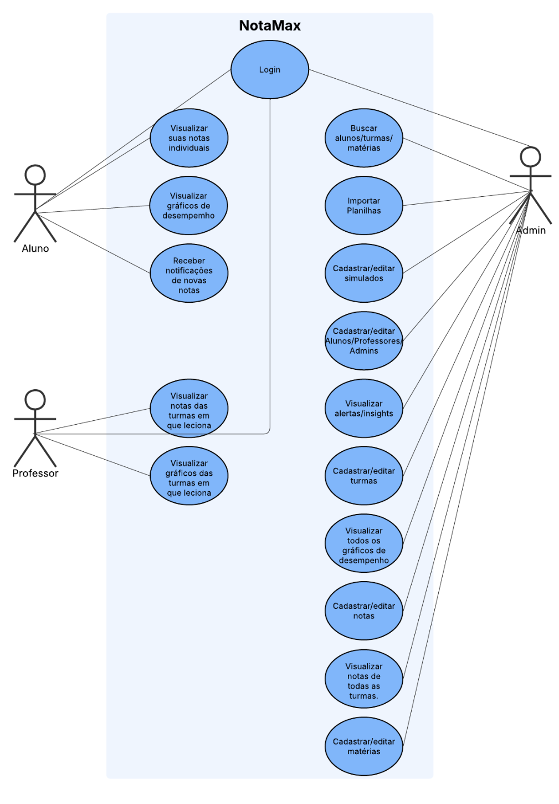

O diagrama de casos de uso mapeia as interações dos atores **Aluno**, **Professor** e **Admin** com o sistema NotasMax (login, cadastro/edição de alunos, professores, turmas, matérias e simulados, importação de planilhas, visualização de gráficos e notas, busca e recebimento de alertas/insights).

## Casos de uso detalhados:

### Caso de Uso: Cadastrar Aluno 
Ator Principal: Administrador 
 
#### Interesses e Interessados: 
- Administrador: Deseja cadastrar novos alunos no sistema Notas Max, 
garantindo que todos os estudantes possuam acesso individual à plataforma. 
- Aluno:  Deseja  ter  um  cadastro  ativo  no  sistema  para  acessar  suas  notas, gráficos de desempenho e notificações personalizadas. 
 
#### Pré-Condições: 
- O ator deve estar autenticado com uma conta de Administrador válida. 
- O sistema deve estar em funcionamento e com acesso à internet para envio de e-mails. 
 
#### Pós-Condições: 
- O aluno é cadastrado com sucesso na base de dados. 
- O sistema gera automaticamente uma senha aleatória temporária. 
- Essa  senha  é  enviada  para  o  e-mail  institucional  do  aluno,  permitindo  seu primeiro acesso à plataforma. 
 
1. Cenário de Sucesso Principal 
2. O administrador acessa o sistema Notas Max. 
3. O administrador seleciona a opção “Cadastrar Aluno” no painel administrativo. 
4. O sistema exibe o formulário de cadastro de aluno. 
5. O administrador preenche os seguintes campos obrigatórios: 
    - Nome Completo 
    - E-mail institucional 
    - Telefone para contato 
    - Telefone do responsável
 
   
 
6. O administrador confirma o envio do formulário. 
7. O sistema valida os dados inseridos e verifica se o e-mail institucional não está duplicado. 
8. O  sistema  gera  automaticamente  uma  senha  aleatória  e  associa  ao  novo cadastro. 
9. O  sistema  envia  um  e-mail  automático  ao  endereço  institucional do  aluno contendo: 
    - Uma mensagem de boas-vindas; 
    - O login (e-mail institucional); 
    - A senha temporária e instruções para redefinição no primeiro acesso. 
10. O sistema exibe a mensagem: “Aluno cadastrado com sucesso. As credenciais 
foram enviadas por e-mail.” 
11. O  novo  aluno  é  adicionado  à  base  de  dados  e  pode  ser  posteriormente 
vinculado a uma turma. 
 
12. Fluxos Alternativos 
    1. Campos não preenchidos corretamente: 
        - Se algum campo obrigatório não for preenchido ou contiver erro de formato (ex: e-mail  inválido),  o  sistema  exibe:  
        >“Preencha todos os campos corretamente para continuar.” 
        - O administrador é redirecionado ao formulário para correção. 
    2. E-mail institucional já cadastrado: 
        - Caso o e-mail inserido já exista no sistema, é exibida a mensagem: 
        >“E-mail já cadastrado. Verifique as informações.” 
        - O administrador poderá revisar os dados antes de reenviar. 
    3. Falha no envio do e-mail: 
        - Se o envio do e-mail automático falhar, o sistema ainda registra o aluno, mas exibe um alerta: 
        >“Aluno cadastrado, porém o e-mail com a senha não pôde ser enviado. Verifique o endereço e tente reenviar.” 
    4. Falha de conexão ou erro no servidor: 
        - Caso ocorra uma falha técnica durante o cadastro, o sistema exibirá: 
        >“Erro ao cadastrar aluno. Tente novamente mais tarde.” 
        - O cadastro não é concluído até que o problema seja resolvido. 
 
   
 
 
13. Extensões e Requisitos Relacionados 
    - RF 1 – Cadastrar Aluno 
 
 
## Caso de Uso: Registrar Notas 
Ator Principal: Administrador 
 
### Interesses e Interessados: 
- Administrador: Deseja lançar  as notas  de alunos para cada simulado, 
garantindo que os resultados fiquem registrados corretamente no sistema. 
- Aluno: Receber suas notas corretamente e poder acompanhar seu 
desempenho. 
- Professor: Consultar e validar notas lançadas em suas turmas. 
 
#### Pré-Condições: 
- O administrador deve estar autenticado no sistema. 
- O simulado e os alunos devem estar previamente cadastrados. 
- As matérias e professores responsáveis pelo simulado devem estar definidos. 
 
#### Pós-Condições: 
- As  notas  dos  alunos  são  registradas  e  associadas  ao  simulado,  matéria, 
professor e peso definido. 
- Os alunos recebem uma notificação automática informando que uma nova nota 
foi registrada. 
 
1. Cenário de Sucesso Principal 
2. O administrador acessa o sistema Notas Max. 
3. Seleciona a opção “Registrar Notas” no painel administrativo. 
4. Escolhe a turma, o simulado e o aluno para lançar a nota. 
5. Preenche os seguintes campos:  
    - Professor responsável 
    - Matéria 
    - Número de acertos 
    - Número total de questões 
    - Peso da avaliação 
6. O sistema calcula automaticamente a nota final do aluno com base nos dados 
inseridos. 
7. O administrador confirma o lançamento da nota. 
8. O sistema salva a informação no banco de dados. 
9. O  aluno  recebe  uma  notificação  automática  informando  sobre  a  nova  nota 
registrada. 
10. O administrador recebe uma mensagem de confirmação: “Nota registrada com 
sucesso.” 
 
11. Fluxos Alternativos 
    1. Campos obrigatórios não preenchidos: 
    - Se algum campo não for preenchido, o sistema exibe: 
        > “Preencha todos os campos obrigatórios antes de continuar.” 
    2. Aluno ou simulado não encontrado: 
    - Se o aluno ou o simulado selecionado não estiver cadastrado, o sistema exibe: 
        > “Registro não encontrado. Verifique os dados e tente novamente.” 
    3.  Erro no cálculo da nota: 
    - Caso ocorra erro no cálculo automático (ex: dados inconsistentes), o sistema exibe: 
        > “Erro ao calcular a nota. Revise as informações e tente novamente.” 
    4. Falha na notificação: 
    - Se a notificação automática não puder ser enviada ao aluno, o sistema registra a nota, mas exibe: 
        > “Nota  registrada,  porém  o  aluno  não  foi  notificado.  Tente reenviar  a notificação.” 
 
12. Extensões e Requisitos Relacionados 
- RF 7 – Registrar Notas  
- RF 12 – Acessar notas (as notas lançadas ficam disponíveis para os alunos) 

---

# 4. Modelo do banco de dados

O modelo físico SQL será disponibilizado após a migração; atualmente o schema físico é o MongoDB.

O banco de dados atual do NotasMax é **não relacional (MongoDB)**, escolhido por garantir persistência e integridade dos dados em todas as fases da aplicação, permitindo estruturar e relacionar as informações de forma consistente.

**Migração planejada para banco relacional:** está em andamento o planejamento de migração do MongoDB para um banco de dados relacional. A proposta, com o levantamento do novo modelo de dados, está disponível em:
https://github.com/NotasMAX/Documentacao/tree/main/modelo-dados

## Escopo atual

O sistema possui usuários com os perfis de aluno, professor e administrador. Também controla matérias, turmas, matrículas, disciplinas oferecidas por turma, simulados e resultados por aluno.

No MongoDB, esses perfis estão armazenados em uma única coleção `Usuario`, diferenciados por `tipo_usuario`. No modelo SQL recomendado, os perfis são tabelas 1:1 especializadas de `usuario`. Cada usuário deve possuir exatamente um perfil; essa exclusividade deve ser garantida por transação na aplicação ou por trigger.

## MER conceitual

O MER identifica as entidades e regras do domínio, sem amarrar o modelo a tipos específicos de banco:

- **USUARIO**: identidade, contato, autenticação e perfil de acesso.
- **ALUNO**: especialização de usuário com dados do responsável.
- **PROFESSOR**: especialização de usuário que leciona disciplinas.
- **ADMINISTRADOR**: especialização de usuário que administra o sistema.
- **MATERIA**: disciplina escolar, como Matemática ou Física.
- **TURMA**: série e ano letivo.
- **MATRICULA**: vínculo entre aluno e turma.
- **TURMA_DISCIPLINA**: matéria oferecida em uma turma e professor responsável.
- **SIMULADO**: avaliação realizada ou agendada para uma turma.
- **SIMULADO_DISCIPLINA**: conteúdo de uma matéria dentro de um simulado, com quantidade de questões e peso.
- **RESULTADO**: desempenho de um aluno em uma matéria de um simulado.

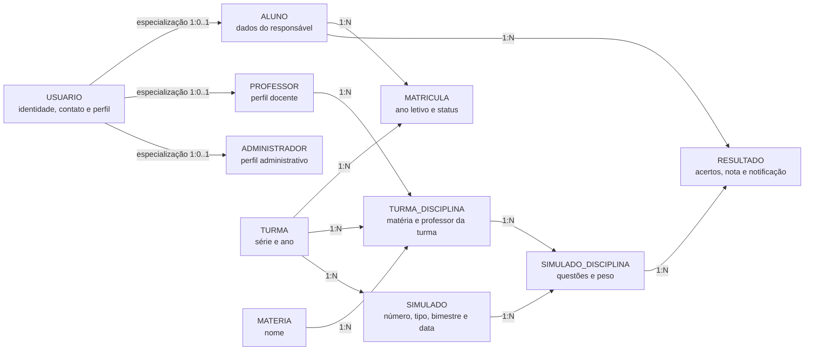

## DER lógico recomendado

As tabelas principais são:

| Tabela | Responsabilidade |
|---|---|
| `usuario` | Dados comuns e autenticação |
| `aluno` | Perfil e dados do responsável |
| `professor` | Perfil de professor |
| `administrador` | Perfil administrativo |
| `materia` | Cadastro das matérias |
| `turma` | Série e ano |
| `matricula` | Alunos vinculados às turmas |
| `turma_disciplina` | Professor e matéria de cada turma |
| `simulado` | Cabeçalho do simulado |
| `simulado_disciplina` | Disciplinas avaliadas e pesos |
| `resultado` | Nota e acertos do aluno |

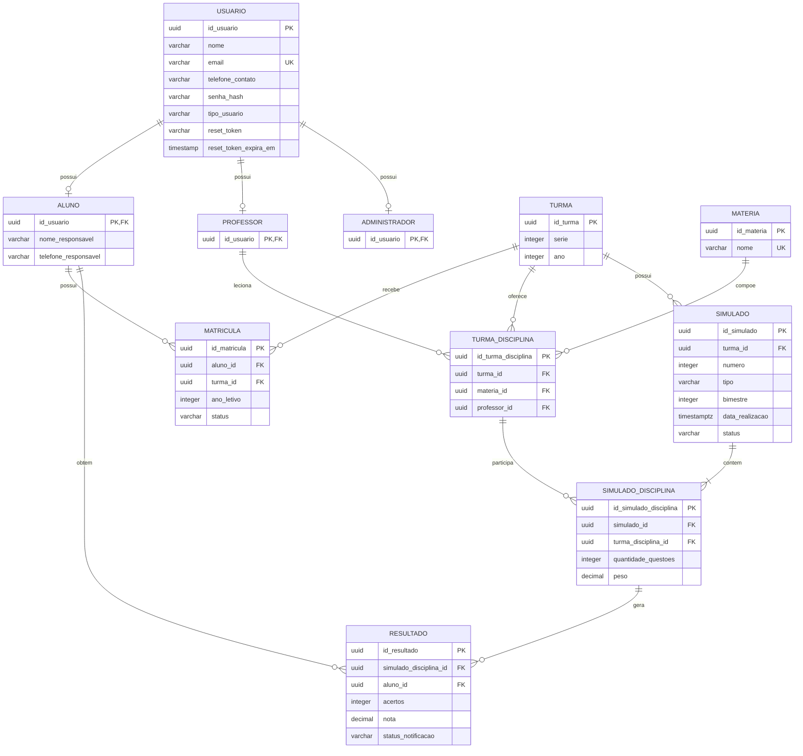

---

# 5. Banco de dados

Tecnologia utilizada: **MongoDB** (não relacional), integrado ao backend Node.js/Express tanto na aplicação web quanto na mobile.

---

# 6. Diagrama de classes

O diagrama de classes representa as classes de domínio do modelo SQL recomendado. `Usuario` é a classe base dos perfis; `Matricula`, `TurmaDisciplina`, `SimuladoDisciplina` e `Resultado` representam os vínculos que possuem atributos próprios.

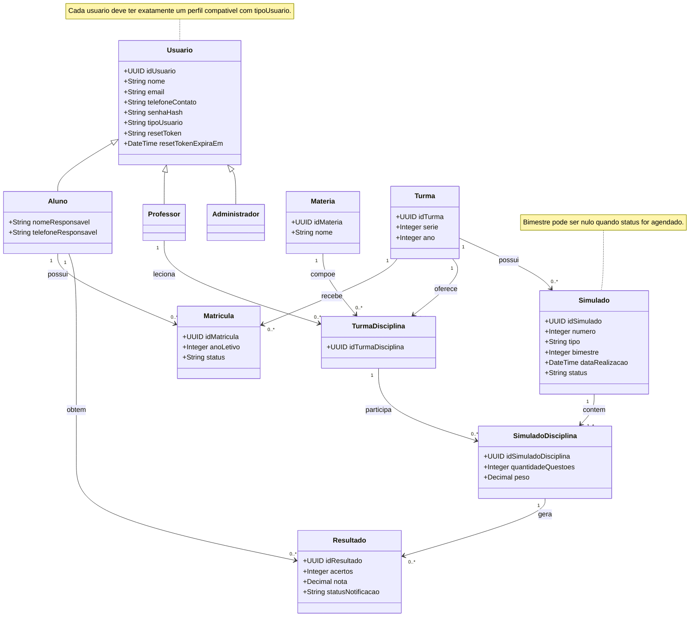

---

# 7. Estudo de viabilidade

**Viabilidade técnica:** plataforma web com acesso remoto, construída em HTML, TailwindCSS, JavaScript, Node.js e MongoDB. A equipe ampliou seus conhecimentos técnicos ao longo do desenvolvimento, possibilitando a implementação eficiente do projeto.

**Viabilidade econômica:** os principais custos concentram-se na hospedagem em nuvem, já que as tecnologias utilizadas são gratuitas. Estima-se dedicação de ~4h semanais por desenvolvedor ao longo do semestre (~80h por integrante), totalizando um custo indireto estimado de ~R$ 2.000,00 por integrante e ~R$ 10.000,00 para a equipe de cinco desenvolvedores (nível júnior, R$ 25,00/hora). Não há investimento em mão de obra externa.

**Viabilidade de mercado:** existe demanda constante por soluções de monitoramento de notas bimestrais, tanto pela direção escolar quanto pelos alunos. O sistema se diferencia por atender exclusivamente às necessidades do Colégio Max, com solução personalizada.

**Viabilidade legal:** o projeto está em conformidade com a LGPD, com políticas de privacidade, consentimento e armazenamento seguro de dados, além de medidas de proteção da propriedade intelectual do sistema.

**Viabilidade organizacional:** a equipe possui capacidade técnica e organizacional, com divisão clara de responsabilidades. O baixo custo operacional (hospedagem em nuvem) torna a manutenção sustentável a longo prazo.

**Análise SWOT (FOFA):**

| Forças | Oportunidades |
|---|---|
| Foco em necessidade real | Expansão para outras escolas |
| Automatização de cálculos | Integração com sistemas educacionais |
| Visualização por gráficos | Avanços em tecnologias de análise de dados (IA) |
| Sistema centralizado | |
| Baixo custo | |

| Fraquezas | Ameaças |
|---|---|
| Dependência do Colégio Max | Resistência de usuários |
| Funcionalidades incompletas | Exigências da LGPD |
| Poucos testes em escala | Dependência de internet |
| Necessidade de treinamento | Riscos de segurança de dados |

---

# 8. Regras de negócio (Modelo canvas)

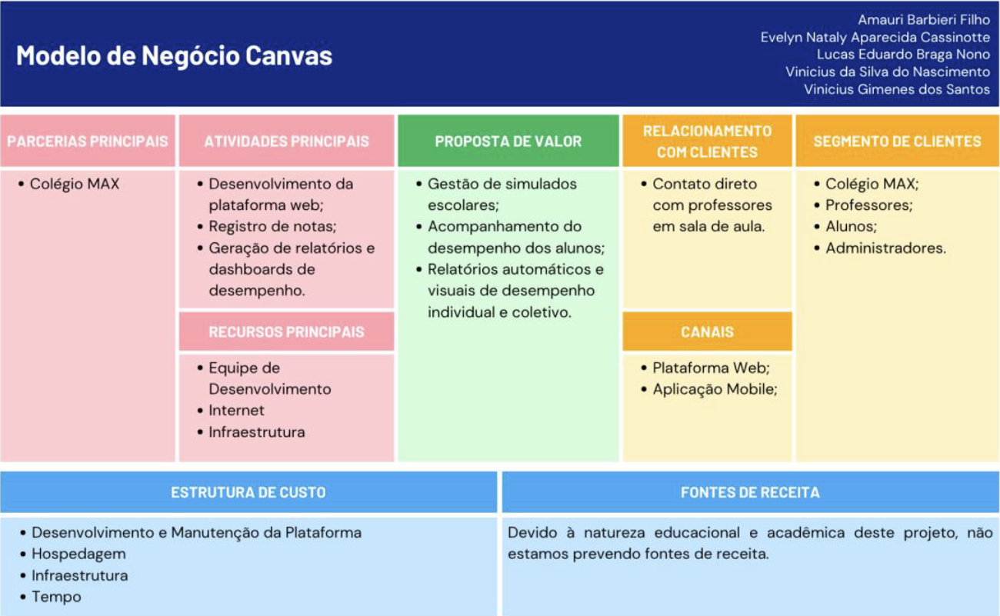

**Proposta de valor:** plataforma web educacional voltada à gestão de notas de simulados, permitindo que administradores cadastrem turmas, matérias, simulados e notas, com cálculo automático das médias bimestrais — digitalizando e otimizando o acompanhamento do desempenho escolar.

**O que será elaborado:** desenvolvimento da plataforma web, registro/gerenciamento de notas, geração de relatórios e dashboards de desempenho.

**Como será elaborado:** parceria principal com o Colégio MAX (feedback e orientação pedagógica); recursos principais — equipe de desenvolvimento, internet e infraestrutura.

**Para quem será elaborado:** Colégio Max — administradores, professores e alunos. Relacionamento mantido por contato direto entre alunos e professores no ambiente escolar. Canais: website (administradores) e aplicação mobile (alunos e professores).

**Quanto vai custar:** estrutura de custos concentrada em desenvolvimento, hospedagem, infraestrutura e tempo da equipe. Por se tratar de projeto acadêmico, não há previsão de fontes de receita.

---

# 9. Design

## Paleta de cores

Definida com base nas cores do logotipo do Colégio Max, garantindo harmonia visual e identidade institucional:

`#FFB90D` `#FFCC00` `#043666` `#1C86EB` `#FFCF58` `#FFE16B` `#4076A9` `#50AAFF` `#FFE29A` `#FFEDA6` `#84BCF2` `#96CCFF`

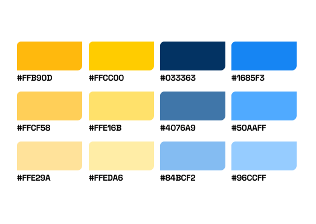

## Tipografia

- **Inter** — fonte principal, presente em toda a aplicação.
- **Space Grotesk** — presente apenas na logo do site.

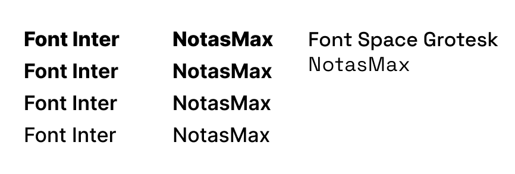

## Logo

A logo utilizada no site é a logo do próprio Colégio Max ("Colégio MAX — Beny Macena").

## Wireframe / Modelo de navegação

Telas principais mapeadas no wireframe:
- Aplicação Web — Tela inicial (dashboard com média geral, turmas de maior/menor desempenho, alertas/insights e gráfico de desempenho por turma)
- Aplicação Web — Tela Editar Turma (gestão de alunos e professores/matérias vinculados)
- Aplicação Web — Tela de Notas por Disciplina de um Aluno
- Aplicação Mobile — Tela Inicial do Aluno (nota geral, evolução, notas por matéria)
- Aplicação Mobile — Tela Inicial do Professor (turmas, médias, média por turma)

O Wireframe do projeto se encontra no Figma: https://www.figma.com/design/3tUP5eB55kFrgwesGN6qAk/NotasMax

---

# 10. Protótipo

Protótipo desenvolvido no **Figma**, disponível em:
https://www.figma.com/design/3tUP5eB55kFrgwesGN6qAk/NotasMax

---

# 11. Aplicação

Telas implementadas do sistema (capturas da aplicação):

## **Aplicação Web** — Tela de Listagem de Matérias (cadastro/edição de matérias)
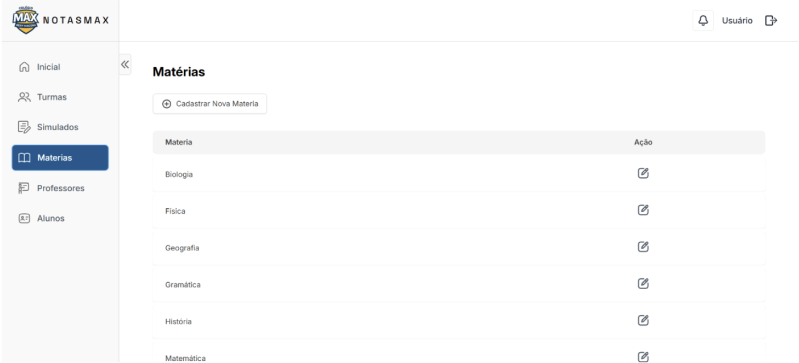

## **Aplicação Web** — Tela de exibição de turmas (por ano letivo)
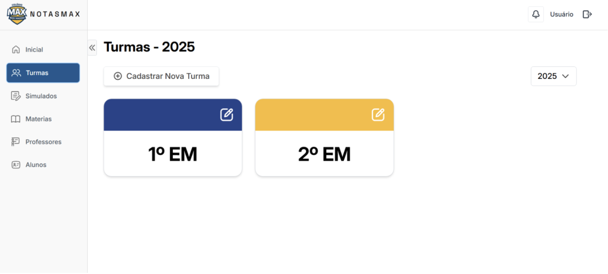

## **Aplicação Web** — Tela de edição de turmas (gerenciamento de alunos vinculados)
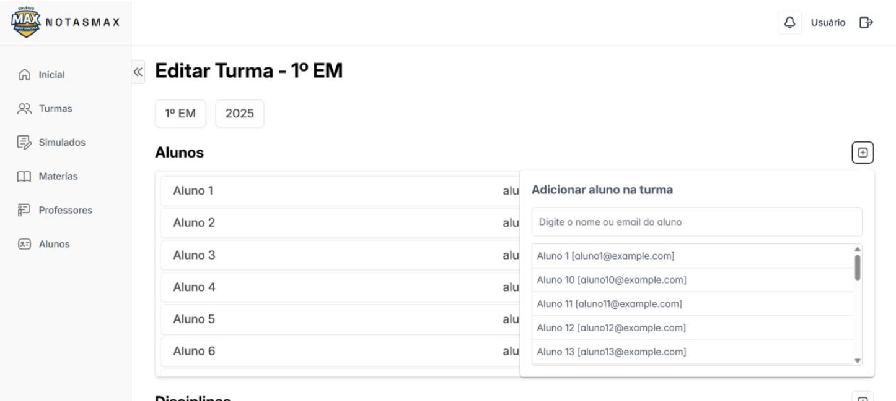

## **Aplicação Mobile** — Tela de Login (acesso via e-mail e senha, com recuperação de senha)
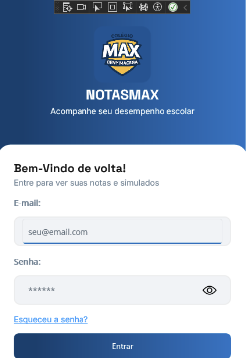

## **Aplicação Mobile** — Turmas do Professor (turmas ativas, total de alunos, médias)
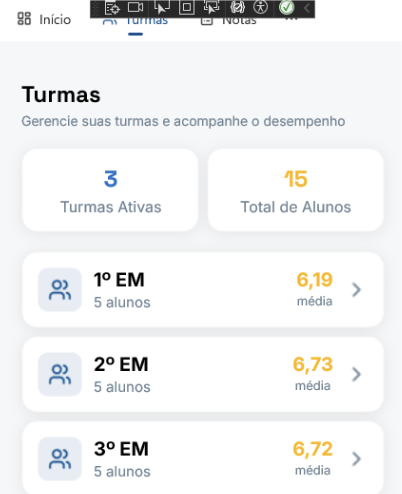

## **Aplicação Mobile** — Desempenho de uma Turma (Professor): médias, melhor/pior aluno, evolução da turma por simulado, comparação entre alunos e distribuição de desempenho (bom/atenção/baixo)
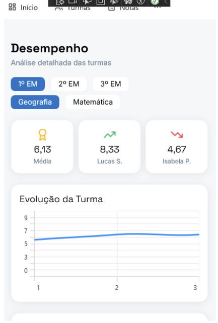

---

# 12. Considerações finais

As principais dificuldades do semestre estiveram relacionadas ao desenvolvimento do aplicativo mobile, já que em semestres anteriores o foco era exclusivamente web — demandando pesquisa e adaptação a esse novo padrão. Este foi também o primeiro contato da equipe com **.NET MAUI**, ainda que já houvesse familiaridade prévia com Visual Studio e C# de um semestre anterior.

No semestre anterior, um escopo maior havia sido definido e nem todas as funcionalidades planejadas foram entregues — o que serviu de aprendizado para a definição de um escopo menor e mais realista neste semestre, permitindo um trabalho mais adequado e uma evolução gradual do projeto a cada semestre.

---

# 13. Referências bibliográficas

- INTER. Fonte utilizada no projeto. Disponível em: https://fonts.google.com/specimen/Inter. Acesso em: 20 de novembro de 2025.
- SPACE GROTESK. Fonte utilizada no projeto. Disponível em: https://fonts.google.com/specimen/Space+Grotesk. Acesso em: 20 de novembro de 2025.
- OPENAI. ChatGPT. Utilizado para geração de personas. Disponível em: https://chat.openai.com/. Acesso em: 20 de novembro de 2025.