
<strong><em>Documentação do PI</em></strong>

<strong>NotasMax — Sistema de Organização de Notas</strong>

**Centro Paula Souza — Faculdade de Tecnologia de Jahu** 
Curso de Tecnologia em Desenvolvimento de Software Multiplataforma 
Documentação do Projeto Interdisciplinar (PI)

Jahu, SP — 6º semestre/2026

**Autores:** Amauri Barbieri Filho,  Evelyn Cassinotte, Lucas Nono, Vinícius Gimenesv e Vinícius Nascimento.

  
<strong>📑 Sumário</strong>

- [1. Introdução](#1-introdução)
  - [Objetivos](#-objetivos)
  - [Metodologia](#-metodologia)
- [2. Requisitos](#2-requisitos)
  - [Requisitos funcionais](#-requisitos-funcionais)
  - [Requisitos não funcionais](#-requisitos-não-funcionais)
- [3. Modelo de casos de uso](#3-modelo-de-casos-de-uso)
- [4. Modelo do banco de dados](#4-modelo-do-banco-de-dados)
- [5. Banco de dados](#5-banco-de-dados)
- [6. Diagrama de classes](#6-diagrama-de-classes)
- [7. Estudo de viabilidade](#7-estudo-de-viabilidade)
- [8. Regras de negócio (Modelo canvas)](#8-regras-de-negócio-modelo-canvas)
- [9. Design](#9-design)
- [10. Protótipo](#10-protótipo)
- [11. Aplicação](#11-aplicação)
- [12. Considerações finais](#12-considerações-finais)
- [13. Referências bibliográficas](#13-referências-bibliográficas)

---

# 1. Introdução

O Colégio Max Beny Macena, atualmente utiliza uma metodologia baseada em simulados semanais, eles envolvem todas as matérias que a turma está aprendendo e compõem a maior parte da nota. Para organiza-las, a escola utiliza planilhas do Excel. É feita uma planilha para cada aluno individualmente, registrando o seu desempenho por bimestre. O problema disso é que apenas a direção tem acesso livre a essas planilhas, para não deixar o aluno completamente no escuro, a direção convoca individualmente os alunos todo final de bimestre para dar um feedback de suas notas.

Reconhecendo a necessidade de melhorar a organização das notas do colégio, apresentamos o projeto NotasMax. Este software permitirá que administradores possam lançar de forma online as notas dos alunos de todas as turmas, permitindo assim, que todos os alunos tenham um acesso melhorado de suas respectivas notas e que os professores e administradores possam acompanhar o desempenho das turmas. O NotasMax visa melhorar a maneira que as notas são organizadas e gerenciadas, e eliminar as dúvidas dos alunos quanto ao seu desempenho geral ao decorrer dos bimestres.

## • Objetivos

### Geral:

Desenvolver e implementar uma solução tecnológica integrada (Web e Mobile) para centralizar e automatizar a gestão de notas de simulados no Colégio MAX, fornecendo aos alunos transparência e autonomia no acompanhamento de seu desempenho escolar, e oferecendo a professores e gestores indicadores visuais de aprendizado para embasar a revisão de conteúdos ministrados, otimizar o planejamento pedagógico e apoiar conselhos de classe.

### Objetivos Específicos:

- **Digitalizar e centralizar os dados avaliativos:** Substituir o uso de planilhas Excel isoladas por uma base de dados estruturada que centralize o histórico de simulados (objetivos e dissertativos) de todas as turmas.
- **Desenvolver um painel administrativo Web:** Criar uma interface web intuitiva para que a administração gerencie turmas, matérias, professores, alunos e calendários de simulados de forma ágil.
- **Construir um aplicativo Mobile multi-perfil (.NET MAUI):** Desenvolver uma aplicação mobile nativa em C# focada na usabilidade de estudantes e docentes, garantindo acesso rápido a notas e relatórios.
- **Fortalecer a gestão pedagógica docente:** Disponibilizar a professores e coordenadores gráficos comparativos de acertos e médias por disciplina e por turma, permitindo identificar lacunas no aprendizado e reajustar a abordagem dos conteúdos em sala de aula.
- **Proporcionar autonomia e previsibilidade ao aluno:** Garantir que o estudante possa visualizar a evolução de suas notas bimestrais, acompanhar médias por matéria e planejar seu rendimento acadêmico de forma contínua.
- **Garantir segurança e privacidade dos dados:** Implementar autenticação robusta, controle de acesso baseado em papéis (RBAC) e armazenamento seguro, atendendo às diretrizes da Lei Geral de Proteção de Dados (LGPD).

## • Metodologia

O cronograma de desenvolvimento foi registrado com uso do **Jira** para melhor organização. O modelo escolhido pela equipe foi o de **prototipação**, por ser considerado mais adequado ao projeto.

O wireframe e o protótipo foram desenvolvidos no **Figma**. A codificação foi feita no **Visual Studio Code**, com a seguinte stack:

**Aplicação Web (Módulo Administrativo & API REST)**

- **Frontend:** React, JavaScript, Tailwind CSS, HTML5, CSS3
- **Backend:** Node.js, Express
- **Banco de Dados Atual:** MongoDB (NoSQL)
- **Planejamento de Evolução:** Migração em andamento para Banco de Dados Relacional (PostgreSQL/MySQL) para otimização do modelo de dados e suporte a relatórios complexos.

**Aplicação Mobile (Módulo Aluno & Professor)**

- **Framework:** .NET MAUI, C#
- **Padrão Arquitetural:** MVVM (Model-View-ViewModel)
- **Visualização de Dados:** Syncfusion (Gráficos)
- **Autenticação e Sessão:** JWT (JSON Web Token) e SecureStorage

Link do protótipo no Figma: https://www.figma.com/design/3tUP5eB55kFrgwesGN6qAk/NotasMax

---

# 2. Requisitos

Um documento de requisitos descreve as funcionalidades, características e restrições que um sistema deve ter para atender às necessidades dos usuários e stakeholders, orientando desenvolvedores, designers e demais membros da equipe.

**Histórias do usuário:**

- Como aluno, quero visualizar minhas notas dos simulados realizados para acompanhar meu desempenho ao longo dos bimestres por meio de gráficos.
- Como professor, quero visualizar gráficos de desempenho das turmas vinculadas a mim para acompanhar o progresso coletivo e identificar possíveis dificuldades.
- Como professor, quero visualizar gráficos de desempenho individual de cada aluno para entender o progresso e as necessidades específicas de cada um.
- Como administrador, quero cadastrar alunos, professores, turmas e matérias para manter o sistema atualizado e organizado.
- Como administrador, quero atualizar e modificar registros (notas, cadastros de alunos/professores, simulados, matérias e turmas) para garantir que as informações estejam sempre corretas.
- Como administrador, quero importar planilhas do Excel com as notas dos simulados para agilizar o processo de atualização e exibir automaticamente os resultados aos alunos e professores.

## • Requisitos funcionais

**Aplicação Web (4º semestre):**

| RF | Descrição |
| --- | --- |
| RF 1 | Cadastrar Aluno (Nome completo, e-mail institucional, telefone de contato, telefone do responsável) — Admin |
| RF 2 | Cadastrar Professor (Nome completo, e-mail institucional, turmas, telefone) — Admin |
| RF 3 | Cadastrar Admin *(implementação futura)* |
| RF 4 | Cadastrar Turmas (Ano, alunos, professores, matérias) — Admin |
| RF 5 | Cadastrar Matérias (Descritivo) — Admin |
| RF 6 | Importar Planilhas do Excel *(implementação futura)* — Admin |
| RF 7 | Registrar Notas (Professor, simulado, matéria, acertos, questões, peso) — Admin |
| RF 8 | Exibir turmas cadastradas — Admin |
| RF 9 | Exibir alunos cadastrados — Admin |
| RF 10 | Exibir professores cadastrados — Admin |
| RF 11 | Alterar Registros (notas dentro do prazo, cadastro de aluno, cadastro de professor) — Admin |
| RF 12 | Acessar todas as notas registradas — Admin |
| RF 13 | Exibir gráfico de desempenho do aluno por bimestre — Aluno/Admin |
| RF 14 | Exibir gráfico comparando médias das classes ao longo dos bimestres — Admin |
| RF 15 | Exibir gráfico comparando a média de um aluno com a da classe — Admin |
| RF 16 | Exibir gráfico comparando acertos da turma por matéria — Admin |
| RF 17 | Redefinir senha (Aluno, Professor, Admin); |
|  | RF 17.1 — Admin altera senha de alunos |
| RF 18 | Cadastrar Simulados (Tipo, data, numeração, turma, matérias, professores, bimestre) — Admin |
| RF 19 | Identificar os tipos de usuário (Administrador, Aluno, Professor) |

**Aplicação Mobile (5º semestre):**

| RF | Descrição |
| --- | --- |
| RF 20 | Alterar notas das matérias sob sua responsabilidade no ano atual — Professor |
| RF 21 | Logar na aplicação mobile — Professor/Aluno |
| RF 22 | Acessar notas de simulados filtradas pela turma vinculada — Aluno |
| RF 23 | Visualizar notas dos alunos das turmas sob sua responsabilidade — Professor |
| RF 24 | Exibir gráfico comparando a média do aluno com a da classe — Aluno |
| RF 25 | Exibir gráfico comparando médias dos alunos de uma turma/disciplina — Professor |
| RF 26 | Exibir calendário com datas de simulados da turma vinculada — Aluno |
| RF 27 | Recuperar senha via código enviado ao e-mail institucional — Aluno/Professor |
| RF 28 | Exibir matérias lecionadas na turma vinculada — Aluno |
| RF 29 | Exibir perfil do usuário logado — Aluno/Professor |
| RF 30 | Exibir turmas com disciplinas cadastradas no ano atual — Professor |

**Requisitos IoT (6º semestre):**

| RF | Descrição |
| --- | --- |
| RF 31 | Armazenar as fotos dos usuários através do storage |
| RF 32 | Armazenar a presença dos alunos durante as provas |
| RF 33 | Detectar o crachá do aluno para registrar sua presença no sistema |
| RF 34 | Exibir uma lista com as presenças registradas do dia do simulado para o usuário Administrador |

## • Requisitos não funcionais

### Requisitos de Produto

(Usabilidade, desempenho e portabilidade — qualidade percebida pelo usuário final)

| RNF | Descrição |
| --- | --- |
| RNF 1 | A aplicação deve ser de fácil navegação, com fluxos intuitivos para cada perfil de usuário. |
| RNF 2 | A aplicação web deve ser responsiva, adaptando-se corretamente a diferentes tamanhos de tela (desktop, tablet e mobile). |
| RNF 3 | O tempo de resposta entre a ação do usuário e a exibição dos resultados (telas, notas e gráficos) deve ser inferior a 3 segundos em conexões comuns. |
| RNF 4 | A aplicação mobile deve ser compatível com os principais sistemas operacionais (Android). |

### Requisitos de Organização

(Conformidade com políticas, regulamentações e ambiente do Colégio Max)

| RNF | Descrição |
| --- | --- |
| RNF 5 | A aplicação deve atender às diretrizes da LGPD, garantindo consentimento, privacidade e proteção dos dados pessoais de alunos e professores. |
| RNF 6 | A aplicação deve respeitar as políticas institucionais do Colégio Max, incluindo o uso exclusivo de e-mails institucionais para autenticação. |

### Requisitos de Confiabilidade

(Segurança, disponibilidade e integridade dos dados)

| RNF | Descrição |
| --- | --- |
| RNF 7 | A aplicação deve ser segura, com autenticação robusta (JWT), controle de acesso por perfil (RBAC) e armazenamento seguro de senhas. |
| RNF 8 | A aplicação deve estar sempre disponível, com alto índice de disponibilidade (uptime) e tolerância a falhas. |

### Requisitos de Implementação

(Restrições de tecnologias, ferramentas e arquitetura)

| RNF | Descrição |
| --- | --- |
| RNF 9 | A aplicação deve ser implementada com as tecnologias definidas no projeto: React, Tailwind CSS, Node.js/Express e MongoDB (web) e .NET MAUI/C# (mobile). |
| RNF 10 | A aplicação mobile deve seguir o padrão arquitetural MVVM (Model-View-ViewModel). |

### Requisitos de Padrões

(Padrões de projeto, de código e de interfaces)

| RNF | Descrição |
| --- | --- |
| RNF 11 | A API deve seguir o padrão REST, com nomenclatura, contratos de dados e códigos de erro consistentes. |
| RNF 12 | O código deve ser versionado no Git, com boas práticas de organização, documentação e revisão entre a equipe. |

### Requisitos de Interoperabilidade

(Integração e comunicação entre sistemas)

| RNF | Descrição |
| --- | --- |
| RNF 13 | As aplicações web e mobile devem compartilhar o mesmo backend via API REST, garantindo consistência dos dados entre as plataformas. |
| RNF 14 | O sistema deve permitir integração futura com outros sistemas, como importação de planilhas Excel e registro de presença por crachá (módulo IoT). |

---

# 3. Modelo de casos de uso

<strong>Figura 1 - Casos de Uso</strong>

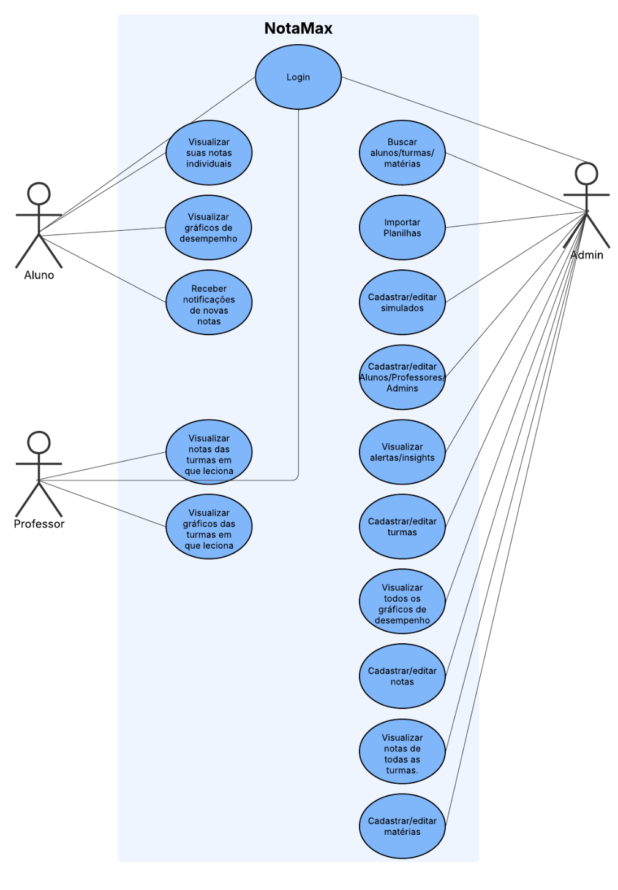

Fonte: Os autores (2025).

O diagrama de casos de uso mapeia as interações dos atores **Aluno**, **Professor** e **Admin** com o sistema NotasMax (login, cadastro/edição de alunos, professores, turmas, matérias e simulados, importação de planilhas, visualização de gráficos e notas, busca e recebimento de alertas/insights).

## Casos de uso detalhados:

### Caso de Uso: Cadastrar Aluno

Ator Principal: Administrador

#### Interesses e Interessados:

- Administrador: Deseja cadastrar novos alunos no sistema Notas Max,

garantindo que todos os estudantes possuam acesso individual à plataforma.

- Aluno:  Deseja  ter  um  cadastro  ativo  no  sistema  para  acessar  suas  notas, gráficos de desempenho e notificações personalizadas.

#### Pré-Condições:

- O ator deve estar autenticado com uma conta de Administrador válida.
- O sistema deve estar em funcionamento e com acesso à internet para envio de e-mails.

#### Pós-Condições:

- O aluno é cadastrado com sucesso na base de dados.
- O sistema gera automaticamente uma senha aleatória temporária.
- Essa  senha  é  enviada  para  o  e-mail  institucional  do  aluno,  permitindo  seu primeiro acesso à plataforma.

1. Cenário de Sucesso Principal
2. O administrador acessa o sistema Notas Max.
3. O administrador seleciona a opção “Cadastrar Aluno” no painel administrativo.
4. O sistema exibe o formulário de cadastro de aluno.
5. O administrador preenche os seguintes campos obrigatórios:
    - Nome Completo
    - E-mail institucional
    - Telefone para contato
    - Telefone do responsável

6. O administrador confirma o envio do formulário.
7. O sistema valida os dados inseridos e verifica se o e-mail institucional não está duplicado.
8. O  sistema  gera  automaticamente  uma  senha  aleatória  e  associa  ao  novo cadastro.
9. O  sistema  envia  um  e-mail  automático  ao  endereço  institucional do  aluno contendo:
    - Uma mensagem de boas-vindas;
    - O login (e-mail institucional);
    - A senha temporária e instruções para redefinição no primeiro acesso.
10. O sistema exibe a mensagem: “Aluno cadastrado com sucesso. As credenciais

foram enviadas por e-mail.”

11. O  novo  aluno  é  adicionado  à  base  de  dados  e  pode  ser  posteriormente

vinculado a uma turma.

12. Fluxos Alternativos
    1. Campos não preenchidos corretamente:
        - Se algum campo obrigatório não for preenchido ou contiver erro de formato (ex: e-mail  inválido),  o  sistema  exibe:

        >“Preencha todos os campos corretamente para continuar.”

        - O administrador é redirecionado ao formulário para correção.
    2. E-mail institucional já cadastrado:
        - Caso o e-mail inserido já exista no sistema, é exibida a mensagem:

        >“E-mail já cadastrado. Verifique as informações.”

        - O administrador poderá revisar os dados antes de reenviar.
    3. Falha no envio do e-mail:
        - Se o envio do e-mail automático falhar, o sistema ainda registra o aluno, mas exibe um alerta:

        >“Aluno cadastrado, porém o e-mail com a senha não pôde ser enviado. Verifique o endereço e tente reenviar.”

    4. Falha de conexão ou erro no servidor:
        - Caso ocorra uma falha técnica durante o cadastro, o sistema exibirá:

        >“Erro ao cadastrar aluno. Tente novamente mais tarde.”

        - O cadastro não é concluído até que o problema seja resolvido.

13. Extensões e Requisitos Relacionados
    - RF 1 – Cadastrar Aluno

### Caso de Uso: Registrar Notas

Ator Principal: Administrador

#### Interesses e Interessados:

- Administrador: Deseja lançar  as notas  de alunos para cada simulado,

garantindo que os resultados fiquem registrados corretamente no sistema.

- Aluno: Receber suas notas corretamente e poder acompanhar seu

desempenho.

- Professor: Consultar e validar notas lançadas em suas turmas.

#### Pré-Condições:

- O administrador deve estar autenticado no sistema.
- O simulado e os alunos devem estar previamente cadastrados.
- As matérias e professores responsáveis pelo simulado devem estar definidos.

#### Pós-Condições:

- As  notas  dos  alunos  são  registradas  e  associadas  ao  simulado,  matéria,

professor e peso definido.

- Os alunos recebem uma notificação automática informando que uma nova nota

foi registrada.

1. Cenário de Sucesso Principal
2. O administrador acessa o sistema Notas Max.
3. Seleciona a opção “Registrar Notas” no painel administrativo.
4. Escolhe a turma, o simulado e o aluno para lançar a nota.
5. Preenche os seguintes campos:
    - Professor responsável
    - Matéria
    - Número de acertos
    - Número total de questões
    - Peso da avaliação
6. O sistema calcula automaticamente a nota final do aluno com base nos dados

inseridos.

7. O administrador confirma o lançamento da nota.
8. O sistema salva a informação no banco de dados.
9. O  aluno  recebe  uma  notificação  automática  informando  sobre  a  nova  nota

registrada.

10. O administrador recebe uma mensagem de confirmação: “Nota registrada com

sucesso.”

11. Fluxos Alternativos
    1. Campos obrigatórios não preenchidos:
    - Se algum campo não for preenchido, o sistema exibe:

        > “Preencha todos os campos obrigatórios antes de continuar.”

    2. Aluno ou simulado não encontrado:
    - Se o aluno ou o simulado selecionado não estiver cadastrado, o sistema exibe:

        > “Registro não encontrado. Verifique os dados e tente novamente.”

    3.  Erro no cálculo da nota:
    - Caso ocorra erro no cálculo automático (ex: dados inconsistentes), o sistema exibe:

        > “Erro ao calcular a nota. Revise as informações e tente novamente.”

    4. Falha na notificação:
    - Se a notificação automática não puder ser enviada ao aluno, o sistema registra a nota, mas exibe:

        > “Nota  registrada,  porém  o  aluno  não  foi  notificado.  Tente reenviar  a notificação.”

12. Extensões e Requisitos Relacionados
- RF 7 – Registrar Notas
- RF 12 – Acessar notas (as notas lançadas ficam disponíveis para os alunos)

---

# 4. Modelo do banco de dados

As versões web e mobile dos semestres 4 e 5 utilizaram MongoDB/NoSQL. A nova versão terá PostgreSQL como requisito. Sua base começará vazia: não haverá migração de registros do MongoDB. Os diagramas desta documentação descrevem o domínio conceitualmente e não constituem schema físico, migrations ou definição final de tipos e constraints.

O detalhamento do modelo conceitual está em [modelo-dados/README.md](modelo-dados/README.md).

## Escopo e regras aprovadas

O modelo contempla usuários e perfis, matérias oferecidas por turma, matrículas, simulados, participantes elegíveis e resultados. As regras de domínio aprovadas para este desenho são:

- Cada usuário possui exatamente um perfil compatível: aluno, professor ou administrador.
- Uma matéria oferecida por uma turma pode ter mais de um professor associado. A associação representa a atribuição atual; não há histórico de professores.
- Ao cadastrar um simulado, são apresentadas as matérias vinculadas à turma escolhida. O administrador pode remover matérias da seleção ou restaurar a lista completa. Professores não são apresentados nessa etapa.
- O número do simulado é inteiro e único por turma e ano letivo, sem depender do bimestre. Um número removido pode ser reutilizado.
- O bimestre é escolhido manualmente entre 1 e 4; não há datas de bimestre definidas no modelo.
- Um simulado pode ser cadastrado com data anterior à data atual, com aviso. Os dados do simulado podem ser editados até a data de realização; as notas podem ser alteradas sem prazo final.
- Quando o simulado ocorre, a lista de alunos elegíveis é congelada com base nas matrículas vigentes nessa data. O tratamento da data final da matrícula ainda não tem definição física.
- Para cada participante congelado e matéria do simulado, o resultado tem estado pendente, avaliado ou ausente. Ausência é explícita; resultado inexistente não significa ausência. Nota zero é válida.
- A nota do simulado é calculada por (acertos / total de questões) × 10; a nota calculada não é armazenada como dado independente.
- Os pesos dos simulados somam 1,0 (100%) por matéria e bimestre. A média final do aluno é a soma das notas dos simulados multiplicadas por seus pesos. Resultado ausente contribui com zero; enquanto houver resultado pendente, a média é provisória e usa os pesos originais, sem redistribuição.
- A média do bimestre da turma é a média aritmética das médias finais dos alunos. Deve ser informado quando houver alunos com notas provisórias. Não são exibidos avisos de possível distorção por ausência ou não participação em simulados.

Casos de alunos que ingressam após um simulado não geram resultado, ausência ou pendência para esse simulado. Como tratar esses alunos nos cálculos de médias ficará para versão posterior.

## MER conceitual

O desenho separa a oferta de matéria, a atribuição atual de professores e a lista congelada de participantes:

~~~mermaid
flowchart LR
    U["USUARIO"]
    A["ALUNO"]
    P["PROFESSOR"]
    AD["ADMINISTRADOR"]
    M["MATRICULA período de validade"]
    T["TURMA série e ano letivo"]
    MT["MATERIA"]
    TD["TURMA_DISCIPLINA matéria oferecida"]
    TDP["TURMA_DISCIPLINA_PROFESSOR associação atual"]
    S["SIMULADO número, tipo, bimestre e data"]
    SD["SIMULADO_DISCIPLINA questões e peso"]
    SA["SIMULADO_ALUNO participante congelado"]
    R["RESULTADO pendente, avaliado ou ausente"]

    U -->|"perfil 1:1"| A
    U -->|"perfil 1:1"| P
    U -->|"perfil 1:1"| AD
    A -->|"matrícula"| M
    T -->|"recebe"| M
    T -->|"oferece"| TD
    MT -->|"é oferecida em"| TD
    TD -->|"atribuições atuais"| TDP
    P -->|"pode lecionar em várias turmas"| TDP
    T -->|"possui"| S
    S -->|"avalia"| SD
    TD -->|"matéria da turma"| SD
    M -->|"vigente na data do simulado"| SA
    S -->|"congela participantes"| SA
    A -->|"participa"| SA
    SA -->|"tem resultado por matéria"| R
    SD -->|"é avaliada em"| R
~~~

A matrícula vigente na data do simulado determina a elegibilidade. O congelamento preserva essa lista mesmo que a situação de matrícula mude depois. A modelagem não define se o último dia de validade é inclusivo.

## DER conceitual proposto

A tabela apresenta entidades e responsabilidades conceituais; nomes, atributos, identificadores e restrições ainda podem mudar no desenho físico.

| Entidade | Responsabilidade |
| --- | --- |
| usuario | Identidade, contato e autenticação |
| aluno, professor, administrador | Perfis 1:1 compatíveis com o usuário |
| materia | Cadastro de matérias |
| turma | Série e ano letivo |
| matricula | Vínculo do aluno com período de validade |
| turma_disciplina | Matéria oferecida por uma turma |
| turma_disciplina_professor | Associação atual, possivelmente múltipla, sem histórico |
| simulado | Número, tipo, bimestre e data de realização |
| simulado_disciplina | Matérias selecionadas, quantidade de questões e peso |
| simulado_aluno | Lista congelada de participantes elegíveis |
| resultado | Estado e desempenho do participante em uma matéria |

~~~mermaid
erDiagram
    USUARIO ||--o| ALUNO : perfil
    USUARIO ||--o| PROFESSOR : perfil
    USUARIO ||--o| ADMINISTRADOR : perfil

    ALUNO ||--o{ MATRICULA : possui
    TURMA ||--o{ MATRICULA : recebe

    TURMA ||--o{ TURMA_DISCIPLINA : oferece
    MATERIA ||--o{ TURMA_DISCIPLINA : compoe
    PROFESSOR ||--o{ TURMA_DISCIPLINA_PROFESSOR : associado
    TURMA_DISCIPLINA ||--o{ TURMA_DISCIPLINA_PROFESSOR : possui

    TURMA ||--o{ SIMULADO : possui
    SIMULADO ||--o{ SIMULADO_DISCIPLINA : contem
    TURMA_DISCIPLINA ||--o{ SIMULADO_DISCIPLINA : pode_ser_selecionada

    SIMULADO ||--o{ SIMULADO_ALUNO : congela_elegiveis
    ALUNO ||--o{ SIMULADO_ALUNO : participante
    SIMULADO_ALUNO ||--o{ RESULTADO : recebe
    SIMULADO_DISCIPLINA ||--o{ RESULTADO : materia_avaliada

    SIMULADO {
        integer numero
        integer bimestre
        date data_realizacao
    }

    MATRICULA {
        date inicio_vigencia
        date fim_vigencia
    }

    SIMULADO_DISCIPLINA {
        integer total_questoes
        decimal peso
    }

    RESULTADO {
        integer acertos

        string status_resultado
    }
~~~

RESULTADO associa um participante congelado a uma matéria do simulado. Conceitualmente, deve existir no máximo um resultado para cada par participante/matéria; cada resultado começa pendente. nota_calculada representa a fórmula de acertos e não decide se o valor será armazenado ou calculado sob demanda. O estado de notificação não faz parte do resultado acadêmico.

## Fotos e presença

O armazenamento de fotos, o registro de presença e a consulta de presenças fazem parte do escopo da aplicação. A entidade a que a foto se vincula, o formato de armazenamento, a identificação para presença (crachá, QR Code ou outra forma), o fluxo de registro e a relação entre presença e resultado continuam pendentes. Por isso, esses elementos ainda não estão representados como entidades neste modelo. Ainda deve ser definido se um simulado pode permanecer sem matérias após a seleção do administrador.

---

# 5. Banco de dados

MongoDB/NoSQL foi utilizado nas versões web e mobile dos semestres 4 e 5. Para a nova versão, PostgreSQL é requisito. A base nova começa vazia e não receberá migração de registros do MongoDB.

---

# 6. Diagrama de classes

O diagrama representa as regras conceituais da seção 4. Ele não define tabelas físicas, tipos SQL, estratégia de autenticação nem a forma de persistir a nota calculada.

~~~mermaid
classDiagram
    class Usuario {
        +UUID idUsuario
        +String tipoUsuario
    }

    class Aluno
    class Professor
    class Administrador

    class Materia {
        +UUID idMateria
        +String nome
    }

    class Turma {
        +UUID idTurma
        +Integer serie
        +Integer anoLetivo
    }

    class Matricula {
        +Date inicioVigencia
        +Date fimVigencia
    }

    class TurmaDisciplina
    class TurmaDisciplinaProfessor

    class Simulado {
        +UUID idSimulado
        +Integer numero
        +String tipo
        +Integer bimestre
        +Date dataRealizacao
    }

    class SimuladoDisciplina {
        +Integer totalQuestoes
        +Decimal peso
    }

    class SimuladoAluno
    class Resultado {
        +Integer acertos

        +String statusResultado
    }

    Usuario <|-- Aluno
    Usuario <|-- Professor
    Usuario <|-- Administrador

    Aluno "1" --> "0..*" Matricula : possui
    Turma "1" --> "0..*" Matricula : recebe
    Turma "1" --> "0..*" TurmaDisciplina : oferece
    Materia "1" --> "0..*" TurmaDisciplina : compoe
    Professor "1" --> "0..*" TurmaDisciplinaProfessor : leciona
    TurmaDisciplina "1" --> "0..*" TurmaDisciplinaProfessor : associacao atual

    Turma "1" --> "0..*" Simulado : possui
    Simulado "1" --> "0..*" SimuladoDisciplina : contem
    TurmaDisciplina "1" --> "0..*" SimuladoDisciplina : pode ser selecionada
    Simulado "1" --> "0..*" SimuladoAluno : congela elegiveis
    Aluno "1" --> "0..*" SimuladoAluno : participa
    SimuladoAluno "1" --> "0..*" Resultado : recebe por materia
    SimuladoDisciplina "1" --> "0..*" Resultado : avaliada

    note for Usuario "Cada usuario possui exatamente um perfil compativel."
    note for TurmaDisciplinaProfessor "Pode haver varios professores; a atribuicao atual nao mantem historico."
    note for Simulado "Numero inteiro unico por turma e ano letivo, independente do bimestre; pode ser reutilizado apos remocao."
    note for SimuladoAluno "Participantes elegiveis sao congelados na data de realizacao, conforme matriculas vigentes."
    note for Resultado "Estados: pendente, avaliado ou ausente. Ausencia explicita contribui com zero; registro inexistente nao significa ausencia. Nota zero e valida."
~~~

---

# 7. Estudo de viabilidade

**Viabilidade técnica:** plataforma web com acesso remoto, construída em HTML, TailwindCSS, JavaScript, Node.js e MongoDB. A equipe ampliou seus conhecimentos técnicos ao longo do desenvolvimento, possibilitando a implementação eficiente do projeto.

**Viabilidade econômica:** os principais custos concentram-se na hospedagem em nuvem, já que as tecnologias utilizadas são gratuitas. Estima-se dedicação de ~4h semanais por desenvolvedor ao longo do semestre (~80h por integrante), totalizando um custo indireto estimado de ~R$ 2.000,00 por integrante e ~R$ 10.000,00 para a equipe de cinco desenvolvedores (nível júnior, R$ 25,00/hora). Não há investimento em mão de obra externa.

**Viabilidade de mercado:** existe demanda constante por soluções de monitoramento de notas bimestrais, tanto pela direção escolar quanto pelos alunos. O sistema se diferencia por atender exclusivamente às necessidades do Colégio Max, com solução personalizada.

**Viabilidade legal:** o projeto está em conformidade com a LGPD, com políticas de privacidade, consentimento e armazenamento seguro de dados, além de medidas de proteção da propriedade intelectual do sistema.

**Viabilidade organizacional:** a equipe possui capacidade técnica e organizacional, com divisão clara de responsabilidades. O baixo custo operacional (hospedagem em nuvem) torna a manutenção sustentável a longo prazo.

**Análise SWOT (FOFA):**

<strong>Figura 2 - Análise FOFA</strong>

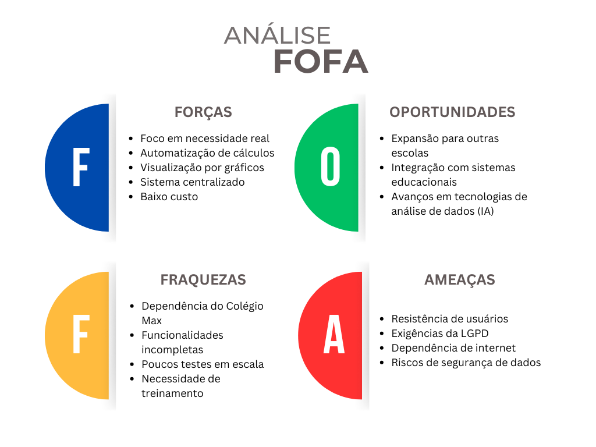

Fonte: Os autores (2026).

| Forças | Oportunidades |
| --- | --- |
| Foco em necessidade real | Expansão para outras escolas |
| Automatização de cálculos | Integração com sistemas educacionais |
| Visualização por gráficos | Avanços em tecnologias de análise de dados (IA) |
| Sistema centralizado |  |
| Baixo custo |  |

| Fraquezas | Ameaças |
| --- | --- |
| Dependência do Colégio Max | Resistência de usuários |
| Funcionalidades incompletas | Exigências da LGPD |
| Poucos testes em escala | Dependência de internet |
| Necessidade de treinamento | Riscos de segurança de dados |

---

# 8. Regras de negócio (Modelo canvas)

<strong>Figura 3 - Modelo Canvas.</strong>

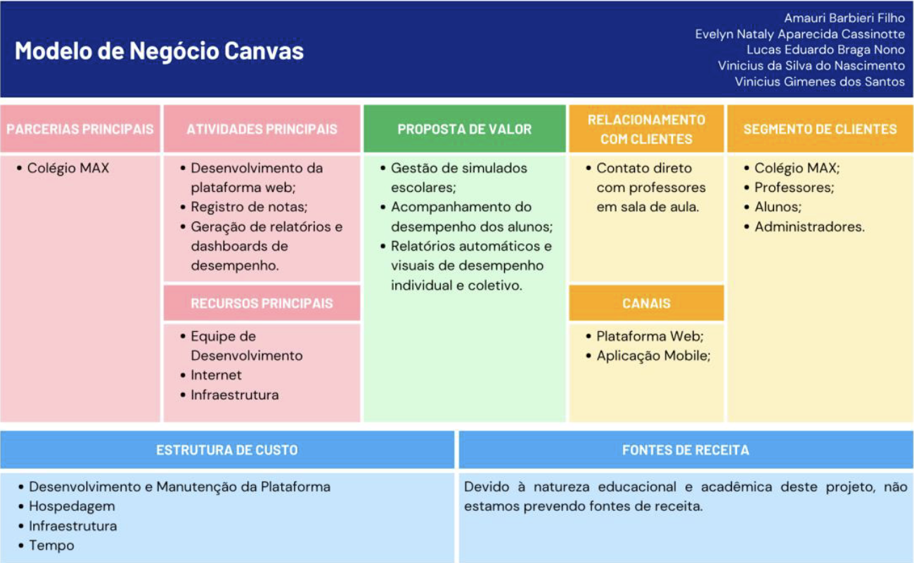

Fonte: Os autores (2026).

**Proposta de valor:** plataforma web educacional voltada à gestão de notas de simulados, permitindo que administradores cadastrem turmas, matérias, simulados e notas, com cálculo automático das médias bimestrais — digitalizando e otimizando o acompanhamento do desempenho escolar.

**O que será elaborado:** desenvolvimento da plataforma web, registro/gerenciamento de notas, geração de relatórios e dashboards de desempenho.

**Como será elaborado:** parceria principal com o Colégio MAX (feedback e orientação pedagógica); recursos principais — equipe de desenvolvimento, internet e infraestrutura.

**Para quem será elaborado:** Colégio Max — administradores, professores e alunos. Relacionamento mantido por contato direto entre alunos e professores no ambiente escolar. Canais: website (administradores) e aplicação mobile (alunos e professores).

**Quanto vai custar:** estrutura de custos concentrada em desenvolvimento, hospedagem, infraestrutura e tempo da equipe. Por se tratar de projeto acadêmico, não há previsão de fontes de receita.

---

# 9. Design

## Paleta de cores

Definida com base nas cores do logotipo do Colégio Max, garantindo harmonia visual e identidade institucional:

`#FFB90D` `#FFCC00` `#043666` `#1C86EB` `#FFCF58` `#FFE16B` `#4076A9` `#50AAFF` `#FFE29A` `#FFEDA6` `#84BCF2` `#96CCFF`

<strong>Figura 4 -Paleta de Cores</strong>

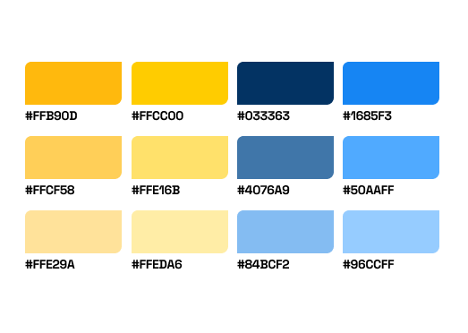

Fonte: Os autores (2025).

## Tipografia

- **Inter** — fonte principal, presente em toda a aplicação.
- **Space Grotesk** — presente apenas na logo do site.

<strong>Figura 5 - Fontes</strong>

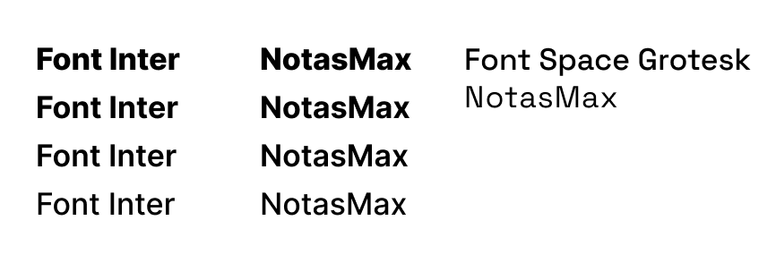

Fonte: Os autores (2025)

## Logo

A logo utilizada no site é a logo do próprio Colégio Max ("Colégio MAX — Beny Macena").

<strong>Figura 6 - Logo Colégio</strong>

Fonte: Os autores (2025).

## Wireframe / Modelo de navegação

<strong>Figura 7 - Userflow</strong>

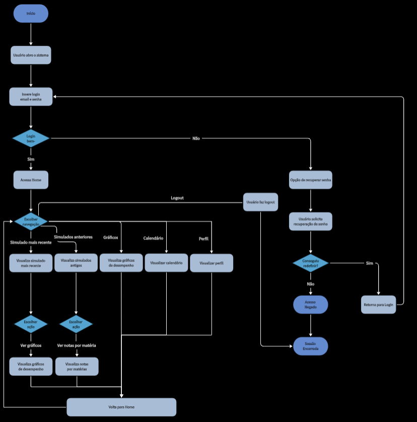

Fonte: Os autores (2026)

Telas principais mapeadas no wireframe:

- Aplicação Web — Tela inicial (dashboard com média geral, turmas de maior/menor desempenho, alertas/insights e gráfico de desempenho por turma)
- Aplicação Web — Tela Editar Turma (gestão de alunos e professores/matérias vinculados)
- Aplicação Web — Tela de Notas por Disciplina de um Aluno
- Aplicação Mobile — Tela Inicial do Aluno (nota geral, evolução, notas por matéria)
- Aplicação Mobile — Tela Inicial do Professor (turmas, médias, média por turma)

<strong>Figura 8 – Aplicação Web – Tela inicial</strong>

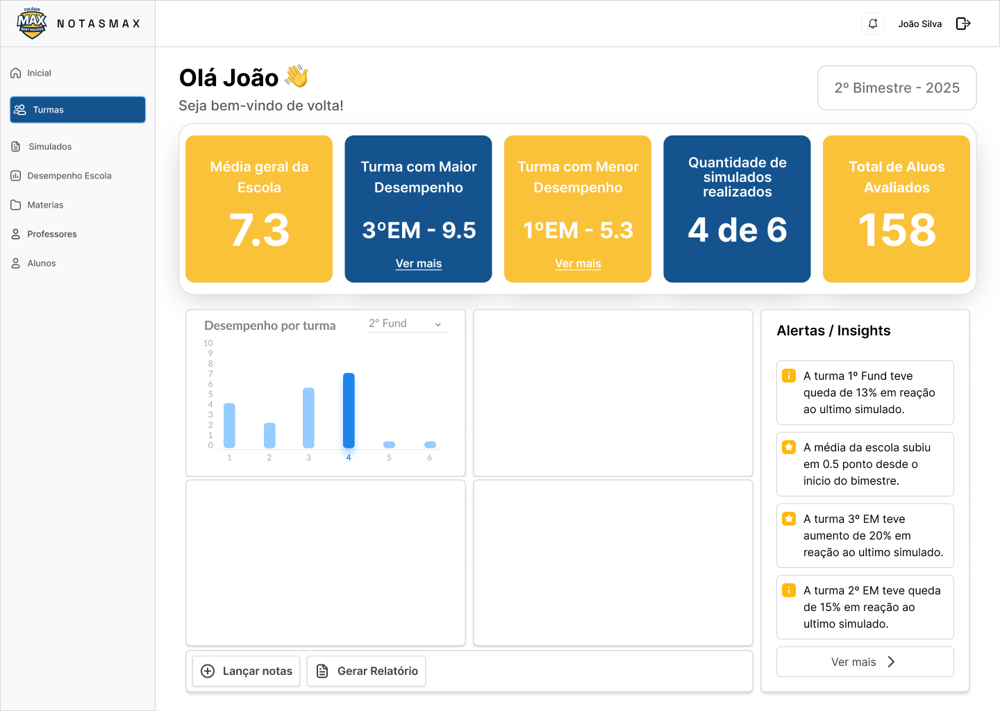

Fonte: Os autores (2025).

<strong>Figura 9 – Aplicação Web – Tela Editar Turma</strong>

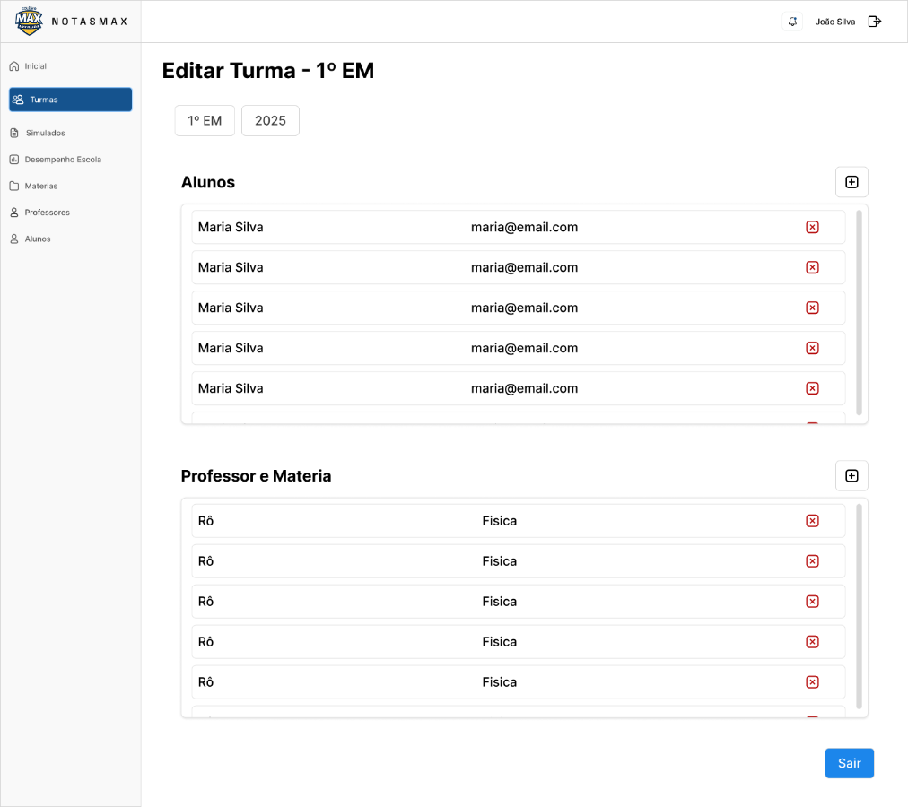

Fonte: Os autores (2025).

<strong>Figura 10 – Aplicação Web – Tela de Notas por Disciplina de um Aluno</strong>

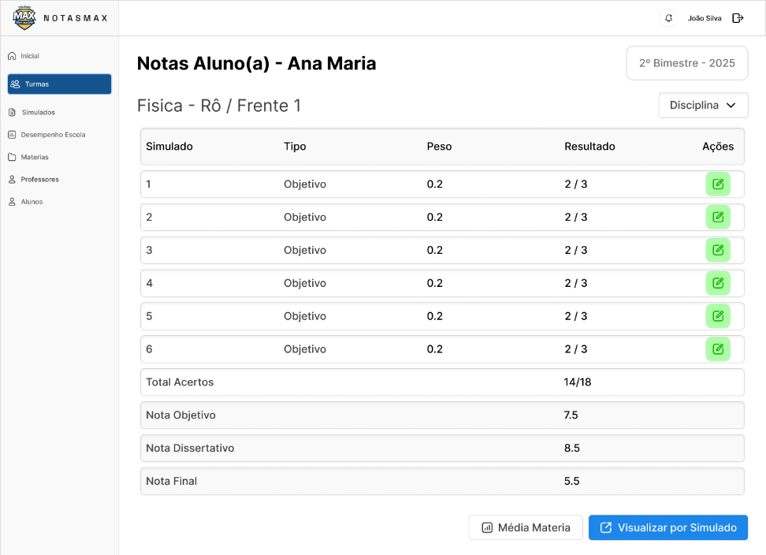

Fonte: Os autores (2025).

<strong>Figura 11 – Aplicação Mobile – Tela Inicial – Aluno</strong>

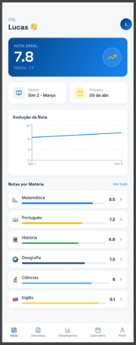

Fonte: Os autores (2026).

<strong>Figura 12 – Aplicação Mobile – Tela Inicial – Professor</strong>

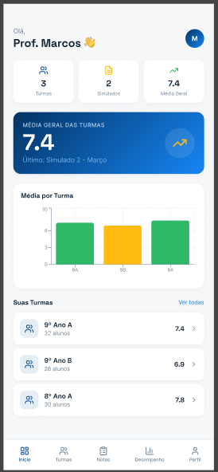

Fonte: Os autores (2026).

<strong>Figura 13 – Aplicação Mobile – Desempenho de uma Turma – Professor</strong>

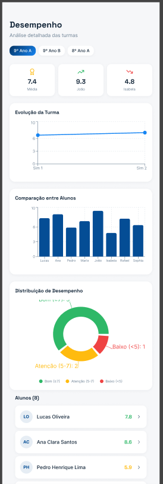

Fonte: Os autores (2026).

O Wireframe do projeto se encontra no Figma: https://www.figma.com/design/3tUP5eB55kFrgwesGN6qAk/NotasMax

---

# 10. Protótipo

Protótipo desenvolvido no **Figma**, disponível em:
https://www.figma.com/design/3tUP5eB55kFrgwesGN6qAk/NotasMax

---

# 11. Aplicação

Telas implementadas do sistema (capturas da aplicação):

## Aplicação Web — Tela de Listagem de Matérias (cadastro/edição de matérias)

<strong>Figura 14 – Aplicação Web – Tela de Listagem de Matérias</strong>

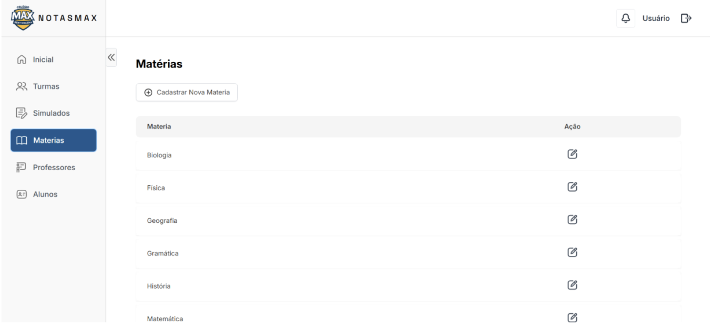

Fonte: Os autores (2025).

## Aplicação Web — Tela de exibição de turmas (por ano letivo)

<strong>Figura 15 – Aplicação Web – Tela de exibição de turmas</strong>

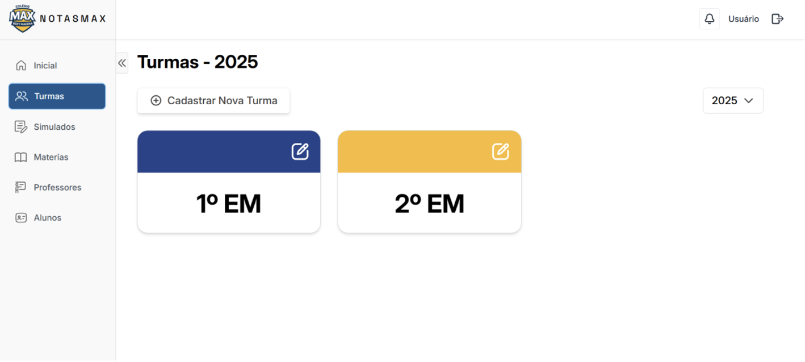

Fonte: Os autores (2025).

## Aplicação Web — Tela de edição de turmas (gerenciamento de alunos vinculados)

<strong>Figura 16 – Aplicação Web – Tela de edição de turmas</strong>

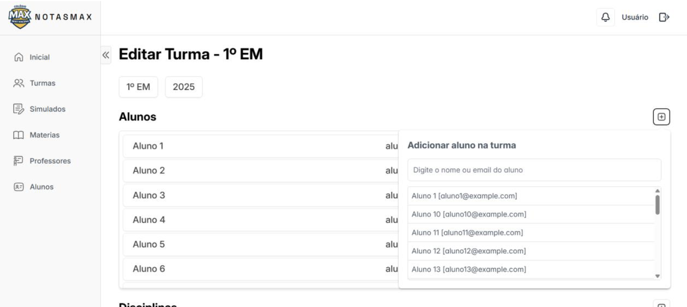

Fonte: Os autores (2025).

## Aplicação Mobile — Tela de Login (acesso via e-mail e senha, com recuperação de senha)

<strong>Figura 17 – Aplicação Mobile – Tela de Login</strong>

Fonte: Os autores (2026).

## Aplicação Mobile — Turmas do Professor (turmas ativas, total de alunos, médias)

<strong>Figura 18 – Aplicação Mobile – Turmas do Professor</strong>

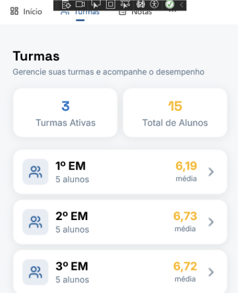

Fonte: Os autores (2026).

## Aplicação Mobile — Desempenho de uma Turma (Professor): médias, melhor/pior aluno, evolução da turma por simulado, comparação entre alunos e distribuição de desempenho (bom/atenção/baixo)

<strong>Figura 19 – Desempenho de uma Turma – Professor</strong>

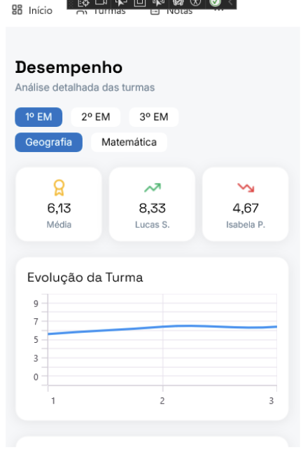

Fonte: Os autores (2026).

---

# 12. Considerações finais

As principais dificuldades do semestre estiveram relacionadas ao desenvolvimento do aplicativo mobile, já que em semestres anteriores o foco era exclusivamente web — demandando pesquisa e adaptação a esse novo padrão. Este foi também o primeiro contato da equipe com **.NET MAUI**, ainda que já houvesse familiaridade prévia com Visual Studio e C# de um semestre anterior.

No semestre anterior, um escopo maior havia sido definido e nem todas as funcionalidades planejadas foram entregues — o que serviu de aprendizado para a definição de um escopo menor e mais realista neste semestre, permitindo um trabalho mais adequado e uma evolução gradual do projeto a cada semestre.

---

# 13. Referências bibliográficas

- INTER. Fonte utilizada no projeto. Disponível em: https://fonts.google.com/specimen/Inter. Acesso em: 20 de novembro de 2025.
- SPACE GROTESK. Fonte utilizada no projeto. Disponível em: https://fonts.google.com/specimen/Space+Grotesk. Acesso em: 20 de novembro de 2025.
- OPENAI. ChatGPT. Utilizado para geração de personas. Disponível em: https://chat.openai.com/. Acesso em: 20 de novembro de 2025.
