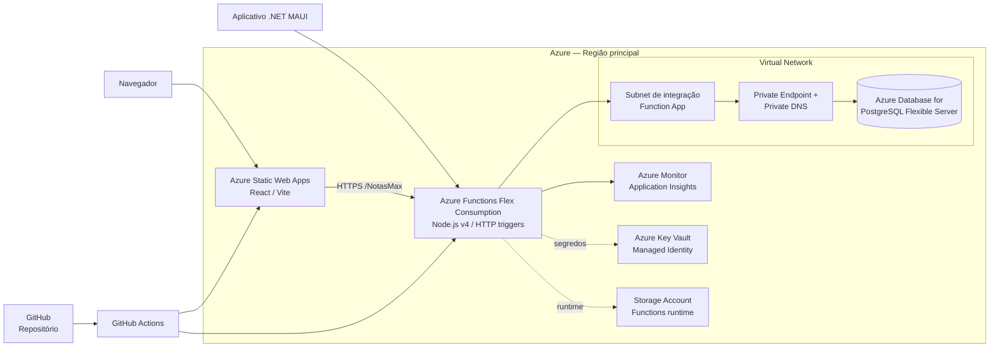

# Arquitetura Azure — NotasMAX

## 1. Objetivo

Este documento propõe a arquitetura de nuvem Azure para o NotasMAX, considerando o estado atual do projeto:

- frontend React/Vite;
- backend Node.js/Express;
- aplicativo mobile .NET MAUI;
- persistência atual em MongoDB;
- migração planejada para PostgreSQL;
- autenticação própria baseada em JWT e envio de e-mail por SMTP.

A recomendação é adotar serviços gerenciados (PaaS) com escala sob demanda, reduzindo a necessidade de administrar máquinas virtuais, sistema operacional e componentes de infraestrutura.

## 2. Decisão arquitetural

| Camada | Serviço Azure | Responsabilidade |
|---|---|---|
| Web | Azure Static Web Apps | Publicar o React/Vite, HTTPS, domínio e integração com CI/CD |
| API — recomendada | Azure Functions Flex Consumption | Executar endpoints HTTP Node.js com cobrança por execução e escala sob demanda |
| Banco SQL | Azure Database for PostgreSQL Flexible Server | Persistir o modelo relacional do NotasMAX |
| Runtime do Functions | Azure Storage Account | Armazenamento exigido pelo runtime do Azure Functions |
| Segredos | Azure Key Vault | Armazenar JWT secret, credenciais SMTP e string de conexão |
| Rede | Azure Virtual Network, Private Endpoint e Private DNS | Isolar o PostgreSQL e permitir acesso privado pela API |
| Observabilidade | Azure Monitor, Application Insights e Log Analytics | Logs, métricas, rastreamento, alertas e diagnóstico |
| Entrega | GitHub Actions | Validar e publicar frontend e backend |
| Arquivos — opcional | Azure Blob Storage | Anexos, documentos ou evidências, caso essa necessidade seja incluída |

O PostgreSQL foi escolhido porque o modelo SQL já documentado usa relacionamentos, chaves estrangeiras, restrições de unicidade e `timestamptz`. O Azure Database for PostgreSQL Flexible Server oferece backups configuráveis e opções de acesso privado para esse cenário.

### Opções de computação

| Opção | Quando usar | Custo e impacto |
|---|---|---|
| Functions Flex Consumption | API com baixa ou média demanda e possibilidade de refatorar o Express | Escala sob demanda; não exige instância mínima no modo On Demand |
| Container Apps Consumption | Preservar a API Express dentro de um container | Escala até zero e cobra por uso; exige Docker e configuração de container |
| App Service | Tráfego contínuo ou necessidade de executar o Express praticamente sem alteração | Mais simples para o código atual, mas menos adequado para custo estritamente por demanda |

Para o perfil atual, a opção principal passa a ser **Azure Functions Flex Consumption**. Azure Container Apps Consumption é a alternativa de menor refatoração. Nenhuma delas torna o banco, o armazenamento, a observabilidade e a rede necessariamente gratuitos; o PostgreSQL é o principal componente a ser controlado.

## 3. Arquitetura alvo

### Fluxo de uma requisição

1. O navegador carrega o frontend publicado no Static Web Apps.
2. O frontend chama a API Node/Express por HTTPS.
3. O aplicativo mobile chama a mesma API usando um endpoint HTTPS configurado por ambiente.
4. A API obtém segredos do Key Vault por identidade gerenciada.
5. A API acessa o PostgreSQL por rede privada, sem expor o banco à Internet.
6. Logs, erros, métricas e traces são enviados ao Azure Monitor/Application Insights.

O Static Web Apps e a Function App podem ser publicados por GitHub Actions, mantendo a entrega reproduzível e auditável.

## 4. Estratégia de custo sob demanda

### Desenvolvimento e homologação

- usar Functions Flex Consumption em modo On Demand;
- usar Azure Database for PostgreSQL em SKU burstable;
- programar Stop/Start do PostgreSQL fora do horário de uso;
- manter retenção de logs curta e sampling no Application Insights;
- não provisionar Front Door, API Management, NAT Gateway ou alta disponibilidade antes de haver necessidade;
- usar VNet e Private Endpoint somente quando a exigência de segurança justificar o custo fixo;
- compartilhar o mínimo possível de recursos, sem compartilhar dados entre ambientes.

Quando o PostgreSQL estiver parado, a cobrança de computação é interrompida, mas armazenamento e eventuais backups continuam sendo cobrados. Essa estratégia é indicada para desenvolvimento e homologação, não para a produção que precisa responder continuamente.

### Produção

- manter a Function App em Flex Consumption;
- manter o PostgreSQL ativo, com backup e capacidade definidos pelo volume real;
- usar VNet Integration e Private Endpoint;
- habilitar Key Vault e Application Insights;
- adicionar Front Door/WAF somente se o tráfego ou o risco justificarem.

O custo final deve ser calculado na região e moeda da assinatura. Os planos de Functions e Container Apps têm cobrança por execução/recursos, mas o banco, armazenamento, logs e componentes de rede podem continuar gerando custos mesmo com pouco tráfego.

## 5. Rede e segurança

### Produção

- Usar HTTPS obrigatório no Static Web Apps e na Function App.
- Manter o endpoint da API público apenas para permitir acesso do navegador e do aplicativo mobile, protegido por autenticação, CORS restritivo e regras de acesso.
- Desabilitar o acesso público do PostgreSQL.
- Integrar a Function App à VNet por uma subnet dedicada quando o PostgreSQL estiver privado.
- Conectar o PostgreSQL por Private Endpoint e resolver o endereço usando Private DNS.
- Não publicar credenciais, JWT secret, SMTP password ou connection string no Git.
- Conceder à Function App apenas a permissão necessária no Key Vault, usando Managed Identity.
- Manter `Secure`, `HttpOnly` e `SameSite` adequados para cookies de autenticação quando cookies forem utilizados.
- Remover logs que contenham senha, token, cookie ou dados pessoais desnecessários.

O Functions VNet Integration é adequado para conexões de saída da aplicação a recursos privados. Private Endpoint é o mecanismo apropriado para conectar clientes da rede privada ao PostgreSQL sem exposição pública.

### Desenvolvimento e homologação

Podem usar banco separado e regras de rede mais simples para reduzir custo e facilitar o trabalho local. Ainda assim, devem ter:

- Key Vault separado ou, no mínimo, segredos separados por ambiente;
- banco separado, sem compartilhar dados reais de produção;
- URLs, CORS e chaves distintas;
- dados de teste anonimizados.

## 6. Organização dos ambientes

Recomenda-se separar os recursos por grupo de recursos:

| Ambiente | Grupo de recursos | Característica |
|---|---|---|
| Desenvolvimento | `rg-notasmax-dev` | Menor custo, dados fictícios e acesso controlado |
| Homologação | `rg-notasmax-hml` | Validação de migração, integração e aceite |
| Produção | `rg-notasmax-prod` | Rede privada, alertas, backup, domínio oficial e políticas de segurança |

Cada ambiente deve ter, no mínimo, API, banco, Key Vault e configuração próprios. O frontend de produção não deve apontar para API ou banco de homologação.

Domínios sugeridos:

- `app.notasmax.<dominio>` para o frontend;
- `api.notasmax.<dominio>` para a API.

## 7. Migração MongoDB → PostgreSQL

### Estratégia recomendada

Para o projeto atual, a opção mais segura e simples é uma migração controlada com pequena janela de indisponibilidade, em vez de introduzir dual-write desde o início.

1. Congelar o modelo relacional documentado.
2. Criar o banco PostgreSQL e executar as migrations.
3. Criar tabelas de estágio para receber a exportação do MongoDB.
4. Exportar os documentos atuais.
5. Transformar e carregar os dados nesta ordem:
   `usuario`/perfis → `materia` → `turma` → `matricula` → `turma_disciplina` → `simulado` → `simulado_disciplina` → `resultado`.
6. Manter um mapa temporário entre os `_id` do MongoDB e as chaves do PostgreSQL para auditoria e reprocessamento.
7. Validar quantidades, chaves estrangeiras, duplicidades, notas, pesos e resultados órfãos.
8. Colocar o sistema antigo em modo de leitura ou manutenção.
9. Executar a carga final, alterar a configuração da API e realizar o smoke test.
10. Manter a exportação original do MongoDB somente até a validação do rollback.

### Regras que precisam ser preservadas

- `email` único e normalizado;
- perfil de usuário consistente com as tabelas `aluno`, `professor` e `administrador`;
- um aluno não pode ter matrículas conflitantes no mesmo ano;
- combinação turma, matéria e professor sem duplicidade;
- unicidade de número, bimestre e turma para simulados;
- `bimestre = 0` convertido para status de simulado agendado, conforme o modelo relacional;
- pesos e notas validados no banco e também na API;
- resultados sempre ligados a um aluno e a um simulado existente.

## 8. Ajustes necessários no código antes do deploy

O deploy Azure não deve ser feito sobre as configurações locais atuais sem esses ajustes:

### Backend

- substituir a URI fixa do MongoDB em `Backend/DB/conn.js` por configuração externa;
- trocar a camada Mongoose por um driver/ORM PostgreSQL e migrations;
- migrar `Backend/index.js` e as rotas Express para o modelo Node.js v4 do Azure Functions;
- registrar endpoints com `app.http()` e remover `app.listen()`, que é gerenciado pelo Functions host;
- extrair autenticação JWT, CORS, validação e tratamento de erros para módulos reutilizáveis;
- reutilizar um pool PostgreSQL entre invocações, limitando conexões e evitando abrir uma conexão nova por requisição;
- adicionar `GET /health` sem autenticação, retornando o estado da Function App e, opcionalmente, do banco;
- ler JWT secret e SMTP a partir do Key Vault/Function App Configuration;
- não executar seeds automaticamente na inicialização da produção.

Se a prioridade for manter o Express quase sem refatoração, empacotar o backend em um container e usar Azure Container Apps Consumption é a alternativa indicada.

### Frontend

- substituir `http://localhost:5000/NotasMax` por `VITE_API_URL`;
- configurar `VITE_API_URL` diferente para desenvolvimento, homologação e produção;
- executar `npm run build` no pipeline;
- validar rotas de SPA e refresh direto de páginas protegidas.

### Aplicativo mobile

- trocar o endpoint padrão local em `GlobalSettings.cs` por configuração de desenvolvimento e produção;
- usar somente HTTPS em produção;
- tratar indisponibilidade da API e expiração de token;
- não incluir segredo de banco ou chave administrativa no aplicativo.

## 9. CI/CD sugerido

O pipeline deve ser dividido em duas entregas independentes:

### Frontend

1. instalar dependências;
2. executar lint e build;
3. publicar o artefato no Azure Static Web Apps;
4. executar teste de disponibilidade da URL.

### Backend

1. instalar dependências;
2. executar lint e testes;
3. validar migrations;
4. publicar na Function App ou no Container App;
5. executar smoke test em `/health`;
6. usar slots somente se o plano de Functions escolhido oferecer esse recurso; no Flex Consumption, preferir estratégia de implantação gradual compatível com o plano.

Migrations destrutivas devem ser executadas em etapa explícita, com backup e aprovação, e não durante o simples start da API.

## 10. Observabilidade e operação

Configurar Azure Monitor/Application Insights para acompanhar:

- disponibilidade do frontend e da API;
- taxa de respostas HTTP 4xx/5xx;
- latência por rota;
- falhas de autenticação e envio de e-mail;
- tempo de consulta e erros de conexão com PostgreSQL;
- execuções, falhas, duração e concorrência da Function App;
- armazenamento, conexões e estado do PostgreSQL;
- execução e falha do pipeline de deploy.

Alertas iniciais recomendados:

- API indisponível;
- aumento de respostas 5xx;
- latência acima do limite definido;
- falha de conexão com o banco;
- espaço de armazenamento baixo;
- falha de backup ou migration.

Realizar teste periódico de restauração do banco. Backup configurado sem teste de restauração não deve ser considerado uma estratégia validada.

## 11. Escopo inicial e evolução

### MVP recomendado

- Static Web Apps;
- Functions Flex Consumption para a API;
- Storage Account do runtime do Functions;
- PostgreSQL Flexible Server;
- Key Vault;
- VNet + Private Endpoint para o banco;
- Azure Monitor/Application Insights;
- GitHub Actions;
- sem App Service, API Management, Service Bus ou Kubernetes;
- Container Apps Consumption como plano B se a refatoração do Express for adiada.

### Evoluções condicionadas ao crescimento

- Azure Front Door com WAF para proteger e distribuir o tráfego público;
- API Management se houver múltiplas APIs, parceiros, versionamento ou necessidade de políticas centralizadas;
- Service Bus para processamento assíncrono de e-mails e notificações;
- Blob Storage para anexos;
- Microsoft Entra External ID para substituir gradualmente a autenticação própria, mantendo autorização de domínio no banco;
- réplica, alta disponibilidade e recuperação em outra região conforme RTO/RPO definidos.

## 12. Critérios de aceite da arquitetura

- frontend, backend e mobile conseguem acessar a API por HTTPS;
- PostgreSQL não aceita conexões públicas em produção;
- API acessa o banco usando segredo fora do código-fonte;
- migrations podem ser executadas de forma repetível;
- dados migrados passam nas validações de contagem e integridade referencial;
- `/health` e os principais indicadores aparecem no Azure Monitor;
- é possível restaurar um backup em ambiente de homologação;
- um deploy com falha pode ser identificado e revertido;
- nenhuma URL `localhost` fica configurada em produção.

## 13. Referências oficiais

- [Azure Static Web Apps](https://learn.microsoft.com/en-us/azure/static-web-apps/)
- [Publicar uma aplicação React no Azure Static Web Apps](https://learn.microsoft.com/en-us/azure/static-web-apps/deploy-react)
- [Azure Functions — referência Node.js](https://learn.microsoft.com/en-us/azure/azure-functions/functions-reference-node)
- [Preços do Azure Functions](https://azure.microsoft.com/en-us/pricing/details/functions/)
- [Preços do Azure Container Apps](https://azure.microsoft.com/en-us/pricing/details/container-apps/)
- [Azure Container Apps](https://learn.microsoft.com/en-us/azure/container-apps/overview)
- [Recursos necessários para o Azure Functions](https://learn.microsoft.com/en-us/azure/azure-functions/functions-infrastructure-as-code)
- [Opções de rede do Azure Functions](https://learn.microsoft.com/en-us/azure/azure-functions/functions-networking-options)
- [Visão geral das Storage Accounts](https://learn.microsoft.com/en-us/azure/storage/common/storage-account-overview)
- [Azure Database for PostgreSQL Flexible Server](https://learn.microsoft.com/en-us/azure/postgresql/configure-maintain/quickstart-create-server)
- [Preços do PostgreSQL Flexible Server](https://azure.microsoft.com/en-us/pricing/details/postgresql/flexible-server/)
- [Private Link para Azure Database for PostgreSQL](https://learn.microsoft.com/en-us/azure/postgresql/flexible-server/concepts-networking-private-link)
- [Referências do Key Vault para App Service e Azure Functions](https://learn.microsoft.com/en-us/azure/app-service/app-service-key-vault-references)
- [Visão geral do Azure Monitor](https://learn.microsoft.com/en-us/azure/azure-monitor/fundamentals/overview)
