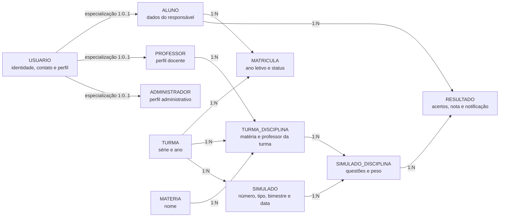
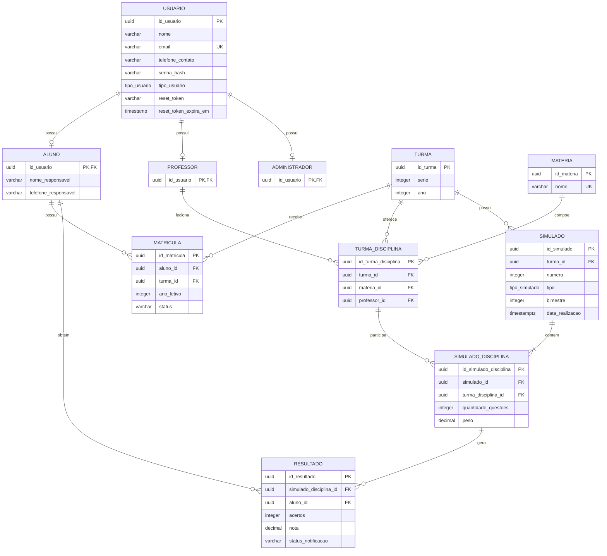
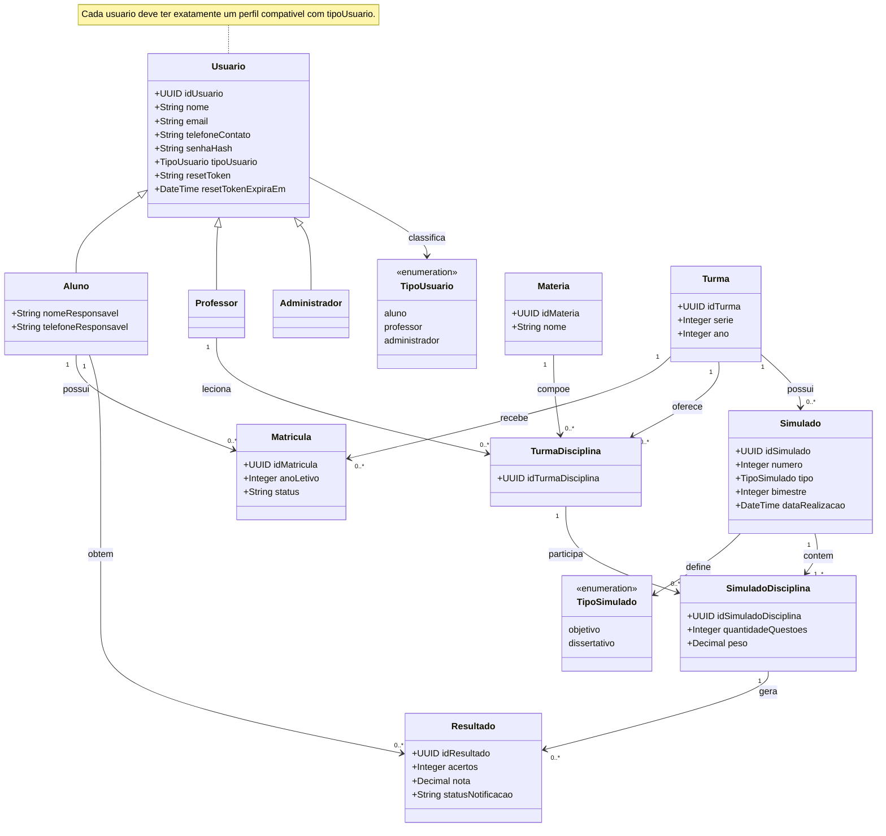

# Modelo de dados do NotasMax

Este documento registra a proposta de migração do banco NoSQL/MongoDB para um banco relacional, preferencialmente PostgreSQL.

## Escopo atual

O sistema possui usuários com os perfis de aluno, professor e administrador. Também controla matérias, turmas, matrículas, disciplinas oferecidas por turma, simulados e resultados por aluno.

No MongoDB, esses perfis estão armazenados em uma única coleção `Usuario`, diferenciados por `tipo_usuario`. No modelo SQL recomendado, os perfis são tabelas 1:1 especializadas de `usuario`. Cada usuário deve possuir exatamente um perfil; essa exclusividade deve ser garantida por transação na aplicação ou por trigger.

## Tipos enumerados do domínio

O modelo SQL deve usar enums para impedir valores fora do domínio em `usuario.tipo_usuario` e `simulado.tipo`:

| Enum | Valores permitidos | Uso |
|---|---|---|
| `tipo_usuario` | `aluno`, `professor`, `administrador` | Perfil do usuário |
| `tipo_simulado` | `objetivo`, `dissertativo` | Tipo de avaliação |

No PostgreSQL, os tipos podem ser criados assim:

```sql
CREATE TYPE tipo_usuario AS ENUM ('aluno', 'professor', 'administrador');
CREATE TYPE tipo_simulado AS ENUM ('objetivo', 'dissertativo');
```

## MER conceitual

O MER identifica as entidades e regras do domínio, sem amarrar o modelo a tipos específicos de banco:

- **USUARIO**: identidade, contato, autenticação e perfil de acesso.
- **ALUNO**: especialização de usuário com dados do responsável.
- **PROFESSOR**: especialização de usuário que leciona disciplinas.
- **ADMINISTRADOR**: especialização de usuário que administra o sistema.
- **MATERIA**: disciplina escolar, como Matemática ou Física.
- **TURMA**: série e ano letivo.
- **MATRICULA**: vínculo entre aluno e turma.
- **TURMA_DISCIPLINA**: matéria oferecida em uma turma e professor responsável.
- **SIMULADO**: avaliação realizada ou agendada para uma turma.
- **SIMULADO_DISCIPLINA**: conteúdo de uma matéria dentro de um simulado, com quantidade de questões e peso.
- **RESULTADO**: desempenho de um aluno em uma matéria de um simulado.



## DER lógico recomendado

As tabelas principais são:

| Tabela | Responsabilidade |
|---|---|
| `usuario` | Dados comuns e autenticação |
| `aluno` | Perfil e dados do responsável |
| `professor` | Perfil de professor |
| `administrador` | Perfil administrativo |
| `materia` | Cadastro das matérias |
| `turma` | Série e ano |
| `matricula` | Alunos vinculados às turmas |
| `turma_disciplina` | Professor e matéria de cada turma |
| `simulado` | Cabeçalho do simulado |
| `simulado_disciplina` | Disciplinas avaliadas e pesos |
| `resultado` | Nota e acertos do aluno |



## Diagrama de classes

O diagrama de classes representa as classes de domínio do modelo SQL recomendado. `Usuario` é a classe base dos perfis; `Matricula`, `TurmaDisciplina`, `SimuladoDisciplina` e `Resultado` representam os vínculos que possuem atributos próprios.



Os campos `createdAt` e `updatedAt` do MongoDB devem ser mapeados para `created_at` e `updated_at` no SQL. Como existem timestamps também nos subdocumentos `conteudos` e `resultados`, eles devem ser preservados em `simulado_disciplina` e `resultado` quando forem necessários para auditoria.

## Mapeamento MongoDB → SQL

| Origem no MongoDB | Destino SQL |
|---|---|
| `Usuarios` | `usuario`, `aluno`, `professor`, `administrador` |
| `Materias` | `materia` |
| `Turmas.alunos[]` | `matricula` |
| `TurmaDisciplinas` | `turma_disciplina` |
| `Simulados` | `simulado` |
| `Simulados.conteudos[]` | `simulado_disciplina` |
| `conteudos.resultados[]` | `resultado` |

Durante a migração, é recomendável guardar o antigo ObjectId em uma coluna `mongo_id` temporária ou permanente. Essa coluna deve ser `UNIQUE` para permitir rastreabilidade e reconciliação.

## Restrições recomendadas

- `usuario.email` deve ser único e armazenado normalizado em minúsculas.
- `materia.nome` deve ser único sem diferenciar maiúsculas e minúsculas.
- `turma(serie, ano)` deve ser único no modelo atual.
- `matricula(aluno_id, turma_id)` deve ser único.
- Para manter a regra atual de uma turma por aluno em cada ano, use `UNIQUE(aluno_id, ano_letivo)`.
- Para preservar o comportamento atual do backend, `turma_disciplina(turma_id, materia_id, professor_id)` deve ser único.
- Se o domínio estabelecer apenas um professor por matéria e turma, substitua pela restrição mais forte `UNIQUE(turma_id, materia_id)`.
- `simulado(turma_id, numero, bimestre)` deve ser único, conforme a regra implementada no controlador.
- `simulado.bimestre` deve ser obrigatório (`NOT NULL`), inclusive quando `data_realizacao` estiver no futuro.
- `simulado` não precisa de coluna `status`; considerar o simulado agendado quando `data_realizacao > CURRENT_TIMESTAMP`.
- `simulado_disciplina(simulado_id, turma_disciplina_id)` deve ser único.
- `resultado(simulado_disciplina_id, aluno_id)` deve ser único.
- `usuario.tipo_usuario` deve usar o enum `tipo_usuario`, aceitando somente `aluno`, `professor` ou `administrador`.
- `simulado.tipo` deve usar o enum `tipo_simulado`, aceitando somente `objetivo` ou `dissertativo`.
- `status_notificacao` deve aceitar somente `pendente` ou `enviada`.
- `acertos` não pode ser negativo nem maior que `quantidade_questoes`.

## Tratamento dos dados inconsistentes

### Bimestre

O modelo MongoDB exige `bimestre`, e um simulado agendado continua pertencendo a um bimestre. O agendamento é uma condição derivada da data de realização:

```sql
data_realizacao > CURRENT_TIMESTAMP
```

Na carga inicial, os registros do `seed4` com `bimestre = 0` devem ser corrigidos para o bimestre real de cada simulado. Não converter `bimestre` para `NULL` nem criar `status = 'agendado'`. Se a instituição trabalhar com quatro bimestres, o valor deve ser validado no intervalo de `1` a `4`.

### Peso

Os seeds utilizam tanto `100.0` quanto `100 / número_de_disciplinas`, enquanto o modelo possui default `1.0`. A proposta SQL adota percentual de `0` a `100`, usando `NUMERIC(5,2)`.

### Notificação

O schema define `notificacao_enviada`, mas alguns seeds usam `notificacao_pendente`. Como o schema está com `strict: true`, esse campo divergente pode ser descartado. Durante a migração, converter ambos para `status_notificacao`.

### Referências de usuários

Alguns schemas usam `ref: "Usuarios"`, enquanto o model é registrado como `Usuario`. A migração deve validar os relacionamentos pelo ObjectId e pelo conteúdo real das coleções, não apenas pelo nome do `ref`.

## Regras que exigem validação adicional

Duas regras atravessam mais de uma tabela e não são garantidas apenas por uma FK simples:

1. Cada usuário deve ter exatamente um perfil compatível com `tipo_usuario`.
2. A `turma_disciplina` usada em `simulado_disciplina` deve pertencer à mesma turma do `simulado`.
3. O aluno de um `resultado` deve estar matriculado na turma do simulado na data da avaliação.

Essas regras devem ser implementadas por transação na aplicação, trigger ou FKs compostas com colunas auxiliares.

## Ordem sugerida de migração

1. Criar as tabelas e constraints básicas.
2. Migrar usuários e guardar o mapeamento `mongo_id → id_usuario`.
3. Criar os perfis de aluno, professor e administrador.
4. Migrar matérias e turmas.
5. Transformar `Turmas.alunos[]` em registros de `matricula`.
6. Migrar `turma_disciplina`.
7. Migrar os cabeçalhos de `simulado`.
8. Explodir `conteudos[]` em `simulado_disciplina`.
9. Explodir `resultados[]` em `resultado`.
10. Validar contagens, chaves, notas, acertos e médias antes de trocar a aplicação para o SQL.

## Observação sobre o desenho

Separar `aluno`, `professor` e `administrador` é uma opção de integridade recomendada. Para uma migração mais rápida, é possível manter todos os dados em `usuario`, preservar `tipo_usuario` e deixar `nome_responsavel` e `telefone_responsavel` como campos opcionais.
